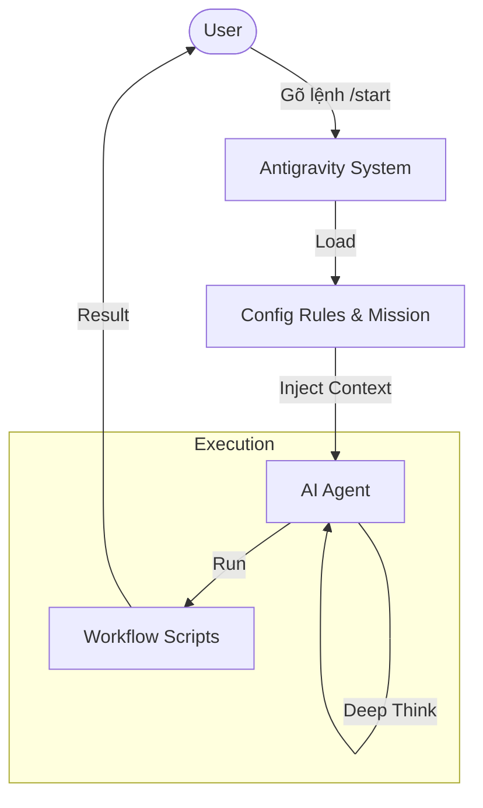

# Kịch Bản Demo: Tính năng "User Dashboard" 🚀

Đây là kịch bản mẫu ("Happy Path") để bạn hình dung cách vận hành **Modular Pipeline** chúng ta vừa xây dựng.

**Feature giả định**: Xây dựng trang **"Dashboard"** để User xem lại lịch sử các PDF đã chuyển đổi thành Video.

---

## Bước 1: Khởi động (`/start`)

**Bạn gõ**: `/start`
**AI hỏi**: "Context là gì? Bạn muốn output gì?"
**Bạn trả lời**: "Tôi muốn làm tính năng Dashboard để user xem lại lịch sử video đã tạo. Cần hiển thị danh sách, trạng thái xử lý, và link play video."

**AI xử lý**:
- Đánh giá độ phức tạp: **High** (Cần API mới, DB tracking, UI Table).
- **Quyết định**: Route sang `/brainstorm`.

---

## Bước 2: Lên Ý Tưởng (`/brainstorm`)

**AI hỏi**: "Ai là người dùng chính? Họ quan tâm thông số nào nhất?"
**Bạn trả lời**: "End-user. Quan tâm: Thumbnail, Tên file PDF, Duration, Status (Processing/Done/Failed)."

**AI Output** (`docs/dashboard/ideas.md`):
- **Persona**: Content Creator (muốn quản lý video).
- **Solution**: Một bảng (Table) có phân trang, có bộ lọc theo ngày.

---

## Bước 3: Nghiên cứu (`/research`)

**AI hỏi**: "Chúng ta dùng thư viện gì cho Table? UI style thế nào?"
**AI Self-Research**:
- Tìm kiếm: "Best React Table library for Next.js" -> Suggest *TanStack Table*.
- Design: Dùng skill `UI UX Pro Max` -> Suggest style "Clean, Minimalist" với *Shadcn UI*.

**AI Output** (`docs/dashboard/research.md`):
- **Tech Stack**: TanStack Table v8, Shadcn UI.
- **Feasibility**: OK.

---

## Bước 4: Chốt Yêu Cầu (`/spec`)

**AI hành động**:
1.  Tổng hợp Idea & Research thành `requirements.md`.
2.  **Translate to Gherkin** (`specs/dashboard/behavior.feature`):

```gherkin
Feature: User Dashboard

  Scenario: View Video History
    Given user is logged in
    When user navigates to "/dashboard"
    Then user sees a list of generated videos
    And each item shows "Thumbnail", "Title", "Status"
```

**Bạn**: "Approved".

---

## Bước 5: Lập Kế Hoạch (`/plan`)

**AI hành động**:
1.  **Tech Design** (`specs/dashboard/design.md`):
    -   **DB**: Table `video_jobs` (id, user_id, pdf_title, status, video_url, created_at).
    -   **API**: `GET /api/v1/jobs` (Pagination).
2.  **Breakdown & Sync GitHub**:
    -   AI tự động chia nhỏ task:
        -   Task 1: Create DB Model `VideoJob`.
        -   Task 2: Create API Endpoint `GET /jobs`.
        -   Task 3: Setup UI Page `/dashboard`.
    -   **AUTO**: Tạo 3 Issues trên GitHub và trả về link.

---

## Bước 6: Thi công (`/build`)

**Bạn gõ**: `/build`

**AI Orchestrator**:
1.  Gọi `/run-backend-feature`:
    -   Wrap logic vào `backend/app/tools/video_history.py` (Tool-Centric).
    -   Implement API & DB Migration.
2.  Gọi `/run-web-feature`:
    -   Code UI Next.js dùng TanStack Table.
    -   Connect API.
3.  **QA**:
    -   Chạy Playwright test để verify User flow login -> dashboard.

**Kết quả**: Tính năng hoàn thành, Code sạch, có Test, đúng quy trình! 🎉

## Cơ Chế Hoạt Động (Architecture)

Đây là cách hệ thống xử lý một lệnh của bạn:



**Phiên bản đơn giản (Text):**

```text
[User] --(/start)--> [System] 
                        |
                 (Load Rules & Mission)
                        |
                        v
                  [AI Agent] --(Deep Think)--> [Workflow] --> [Result for User]
```

## Giải Thích Chi Tiết (Deep Dive)

Đây là những gì diễn ra ở hậu trường:

### Phase 1: Nạp Dữ Liệu (Initialization)
- **Hành động**: Khi bạn gõ lệnh, System lập tức đọc `.agent/rules/`.
- **Dữ liệu nạp**:
    -   `mission.md`: Mục tiêu tối thượng (PDF to Video).
    -   `project-context.md`: Kiến trúc dự án (FastAPI/Next.js) & Các điều cấm (No `rm -rf`).

### Phase 2: Nhập Vai (Personification)
- **Hành động**: System "tiêm" (inject) thông tin vào não bộ của AI.
- **Kết quả**: Tôi không còn là một AI chung chung nữa. Tôi trở thành **"Google Antigravity Expert"** với đầy đủ kiến thức về dự án của bạn.

### Phase 3: Tư Duy Sâu (Reasoning)
- **Hành động**: Trước khi viết code, tôi bị buộc phải "Suy nghĩ" (`<thought>`).
- **Tại sao?**: Để đảm bảo tôi không làm bừa. Tôi phải tự vấn: *"Code này có clean không? Có vi phạm rule Tool-Centric không?"*.

### Phase 4: Thực Thi (Execution)
- **Hành động**: Tôi chạy các bước trong Workflow (`/brainstorm`, `/build`...).
- **Kết quả**: Code được sinh ra chính xác, an toàn và đúng chuẩn ngay từ lần đầu tiên.
