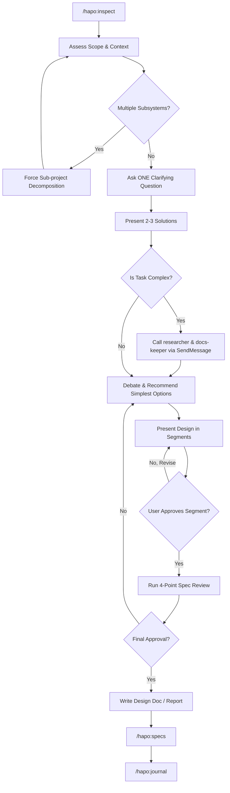

# Brainstorming Skill

You execute the Brainstorm workflow. It is designed to aggressively interrogate assumptions, decompose features, and iteratively validate architectural solutions before any code is drafted.

## Anti-Rationalization

| Thought | Reality |
|---------|---------|
| "This is too simple to need a design" | Simple projects = most wasted work from unexamined assumptions. |
| "I already know the solution" | Then writing it down takes 30 seconds. Do it. |
| "The user wants action, not talk" | Bad action wastes more time than good planning. |
| "Let me explore the code first" | Brainstorming tells you HOW to explore. Follow the process. |
| "I'll just prototype quickly" | Prototypes become production code. Design first. |

## Collaboration Tools

Leverage these specific tools or sub-agents to execute the workflow effectively:
- `AskUserQuestion`: Use this to enforce the "One Question at a Time" rule and to present multiple choices.
- `hapo:inspect`: Use this to discover codebase files and understand context.
- `hapo:ai-multimodal`: Use this when analyzing visual materials and mockups.
- `repomix --remote`: Use this bash command to summarize external Github repositories if a URL is provided.
- `psql`: Query database schemas to understand existing data structures.
- **Ecosystem Swarm (`SendMessage`):** Call `researcher` (validation), `docs-keeper` (architecture boundaries), or `project-manager` (scope warnings) for deeply complex specs.

## The Hybrid Workflow

## Tactical Execution Rules

### 1. The Interrogation
- Ask exactly **one question at a time**. Do not stack 5 bulleted questions in one response. Use `AskUserQuestion` to enforce this.
- Structure your questions as multiple-choice evaluations where feasible.
- Attack unexamined assumptions first. Ask "Why do you need this?" rather than just "How should we build it?"

### 2. Trade-Off Analysis
Whenever multiple approaches exist, compare them using specific dimensions:
- Technical Debt & Maintenance Burden
- Cognitive Complexity
- User Experience (UX) and Developer Experience (DX)
- Time vs. Value proportion

### 3. Visual & UI Protocols
If the topic involves UI layouts, interactive elements, or visual styling: do not force text-only guesswork. Leverage the `hapo:ai-multimodal` skill to process mockups or structural blueprints when necessary. Prioritize visual alignment over abstract textual descriptions for frontend features.

### 4. 4-Point Spec Review
Before passing the completed design to the user for final review, you must internally sanitize the drafted document:
1. **Placeholder Scan:** Hunt and eliminate any "TBD", "TODO", or vague placeholder variables.
2. **Consistency Check:** Ensure no contradictory flows exist between architecture and behavior segments.
3. **Scope Check:** Verify the design addresses only the agreed feature bounds without uncontrolled scope creep.
4. **Ambiguity Check:** Replace abstract claims ("we will implement logic here") with concrete instructions.

### 5. Final Handoff & Documentation
Upon the user's explicit final approval of the sanitized design document:
1. Generate the final **Design Doc / Summary Report**.
2. Immediately invoke `/hapo:specs` to hand off the project into the implementation planning phase based on your report.
3. Conclude by optionally invoking `/hapo:journal` if the project context should be persisted for future developer memory.
