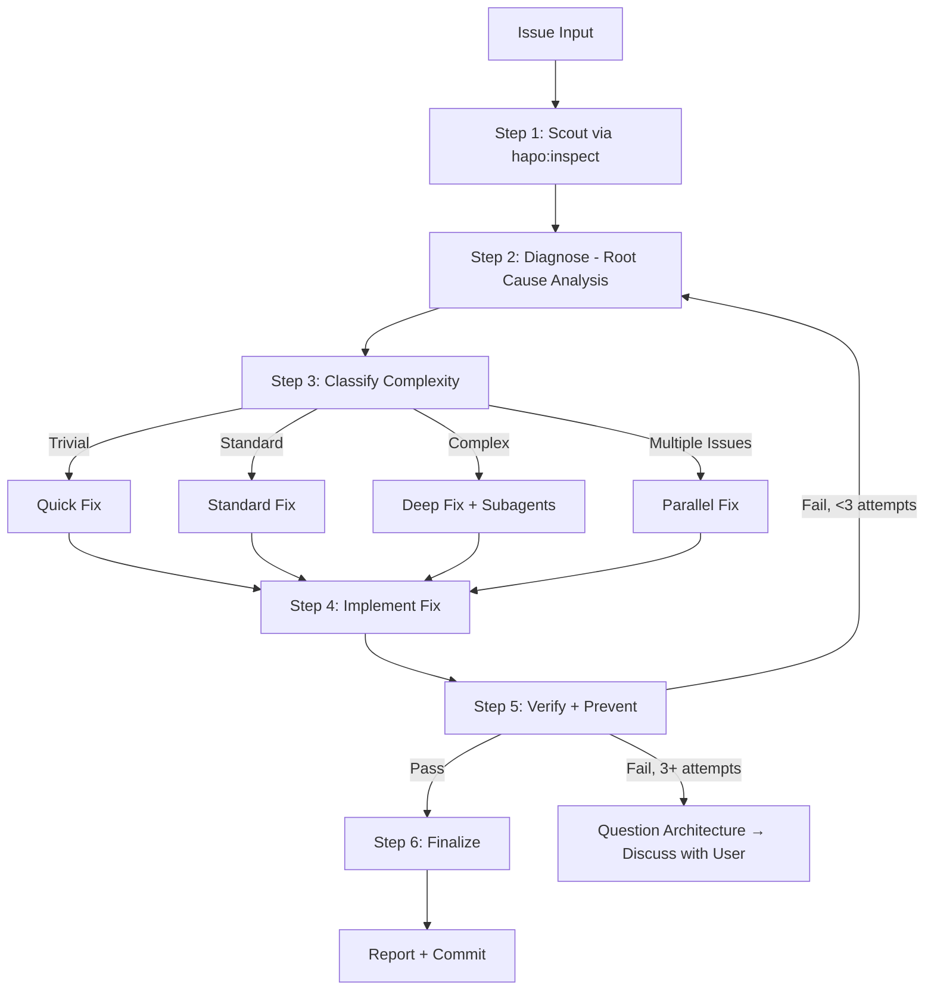

# Hotfix — Structured Bug Elimination

Kill bugs systematically. No guessing. Evidence first, fix second.

## Arguments

- `--quick` - Fast track for trivial issues (lint, type errors, syntax)
- `--parallel` - Spawn multiple `god-developer` agents for independent issues

Default: Autonomous mode — auto-approve when confidence is high.

<HARD-GATE>
Do NOT propose or implement fixes before completing Steps 1-2 (Scout + Diagnose).
Symptom fixes are FAILURE. Find the root cause first.
If 3+ fix attempts fail → STOP. Question the architecture. Discuss with user.
Exception: `--quick` mode allows abbreviated scout→diagnose→fix for trivial issues.
</HARD-GATE>

## Anti-Rationalization

| Thought | Reality |
|---------|---------|
| "I can see the problem, let me fix it" | Seeing symptoms ≠ understanding root cause. Scout first. |
| "Quick fix for now, investigate later" | "Later" never comes. Fix properly now. |
| "Just try changing X" | Random fixes waste time and create new bugs. Diagnose first. |
| "It's probably X" | "Probably" = guessing. Use structured diagnosis. |
| "One more fix attempt" (after 2+) | 3+ failures = wrong approach. Question architecture. |

## Process Flow



**This diagram is the authoritative workflow.** If prose conflicts with this flow, follow the diagram.

---

## Step 1: Scout (MANDATORY — never skip)

**Purpose:** Understand the affected codebase BEFORE forming any hypotheses.

**Action:** Activate `hapo:inspect` skill to map the blast radius.

| Mode | Scout Depth |
|------|-------------|
| `--quick` | Minimal — locate affected file(s) and direct dependencies only |
| Standard | Full — map module boundaries, test coverage, call chains |
| `--parallel` | Per-issue independent scouts |

**Checklist:**
- [ ] Affected files identified
- [ ] Direct dependencies mapped (imports/exports)
- [ ] Related tests located
- [ ] Recent git changes checked: `git log --oneline -10 -- <affected-files>`

**Output:** `✓ Step 1: Scouted — [N] files mapped, [M] dependencies, [K] tests found`

---

## Step 2: Diagnose (MANDATORY — never skip)

**Purpose:** Evidence-based root cause analysis. NO guessing.

See `references/diagnosis-protocol.md` for full methodology.

**Mandatory chain:**
1. **Capture pre-fix state:** Record exact error messages, failing test output, stack traces. This is your baseline for Step 5.
2. **Observe:** Read the actual error. Where does it occur? When did it start? (`git log -p`)
3. **Hypothesize:** Form 2-3 hypotheses through structured reasoning:
   ```
   Hypothesis: [statement]
   Confirm if: [what evidence would prove it]
   Refute if: [what evidence would disprove it]
   Quick test: [how to verify fast]
   ```
4. **Test:** Use `Grep`, `Read`, or spawn parallel `Explore` subagents to validate each hypothesis against codebase evidence.
5. **Trace root cause:** Follow the chain backward — symptom → immediate cause → contributing factor → **ROOT CAUSE**.
6. **Escalate:** If 2+ hypotheses fail, apply Inversion Thinking (see `references/escalation-tactics.md`).

**Output:** `✓ Step 2: Diagnosed — Root cause: [summary], Evidence: [brief], Scope: [N files]`

---

## Step 3: Classify Complexity

| Level | Indicators | Workflow |
|-------|------------|----------|
| **Trivial** | Single file, clear error, type/lint/syntax | Quick: straight to fix |
| **Standard** | Multi-file, root cause identified via diagnosis | Standard: fix + regression test |
| **Complex** | System-wide, architecture impact, unclear boundaries | Deep: research + plan + fix |
| **Parallel** | 2+ independent issues OR `--parallel` flag | Spawn `god-developer` agents per issue |

**Task Orchestration (Standard+ only):**
- Use `TaskCreate` with dependencies to track fix phases
- Skip for Trivial (overhead exceeds benefit)

**Output:** `✓ Step 3: [Complexity] detected — [workflow] selected`

---

## Step 4: Implement Fix

**Rules:**
- Fix the ROOT CAUSE, not the symptom. Follow diagnosis findings.
- Minimal changes only. Follow existing code patterns.
- One logical change per commit boundary.

### Quick Workflow
1. Apply the obvious fix directly from diagnosis
2. Run typecheck/lint immediately

### Standard Workflow
1. Implement fix targeting root cause
2. Add/update regression test that fails without fix, passes with it
3. Run full test suite

### Deep Workflow
1. **Parallel investigation:** Launch Steps 1+2+3 concurrently — Scout (`hapo:inspect`), Diagnose (from error context), and Research (`researcher` subagent) all run simultaneously. See `references/parallel-patterns.md` Pattern E.
2. Synthesize findings from all three into a unified fix approach
3. Plan the fix (consider writing to `references/` for future use)
4. Implement in stages, verifying each stage
5. Comprehensive regression tests

### Parallel Workflow
1. Create separate `TaskCreate` per independent issue
2. Spawn `god-developer` subagents — one per issue
3. Each agent follows Steps 1-5 independently
4. Aggregate results upon completion

**Output:** `✓ Step 4: Fixed — [N] files changed`

---

## Step 5: Verify + Prevent (MANDATORY — never skip)

**Purpose:** Prove the fix works AND prevent the same bug class from recurring.

**Mandatory chain:**
1. **Iron-law verification:** Run the EXACT commands from pre-fix state capture (Step 2). Compare output. NO claims without fresh terminal evidence.
2. **Regression test:** The test MUST fail without the fix and pass with it.
3. **Parallel verification:** Run typecheck + lint + build + test simultaneously via `Bash`. See `references/parallel-patterns.md` Pattern C.
4. **Prevention guard (Standard+ only):** See `references/prevention-gate.md`.
5. **Code review:** Trigger `hapo:code-review` and handle results per `references/review-cycle.md` (autonomous auto-approve loop or HITL depending on fix criticality).

**If verification fails:**
- < 3 attempts → Loop back to Step 2 (re-diagnose with new evidence)
- 3+ attempts → STOP. Question architecture. Discuss with user.

**Output:** `✓ Step 5: Verified + Prevented — [before/after comparison], [N] tests added`

---

## Step 6: Finalize (MANDATORY — never skip)

1. **Report:** Confidence score, root cause, changes made, files affected, prevention measures
2. **Docs update:** If API/behavior changed → delegate to `docs-keeper` subagent
3. **Task cleanup:** `TaskUpdate` → mark all tasks `completed` (skip if no tasks created)
4. **Commit:** Ask user if ready to commit via `git-ops` subagent

**Output:** `✓ Step 6: Complete — [action taken]`

---

## Output Format

Unified step markers (emit after each step):
```
✓ Step 1: Scouted — [N] files, [M] deps
✓ Step 2: Diagnosed — Root cause: [summary]
✓ Step 3: [Complexity] detected — [workflow] selected
✓ Step 4: Fixed — [N] files changed
✓ Step 5: Verified + Prevented — [tests added], [guards added]
✓ Step 6: Complete — [action taken]
```

## Subagent Usage

| Subagent | When |
|----------|------|
| `debugger` | Root cause unclear, need deep systematic investigation (Step 2) |
| `Explore` (parallel) | Scout multiple areas (Step 1), test hypotheses (Step 2) |
| `Bash` (parallel) | Verify: typecheck + lint + build + test (Step 5) |
| `researcher` | External docs needed (Deep workflow only) |
| `test-runner` | After fix, verify correctness (Step 5) |
| `hapo:code-review` | After fix, quality check (Step 5) |
| `git-ops` | Commit changes (Step 6) |
| `docs-keeper` | Update docs if behavior changed (Step 6) |
| `god-developer` | Parallel independent issues (each gets own agent) |

## References

Load as needed:
- `references/diagnosis-protocol.md` — Structured root cause analysis methodology
- `references/escalation-tactics.md` — What to do when hypotheses fail (Inversion, Scale Game)
- `references/prevention-gate.md` — Defense-in-depth validation after fix
- `references/review-cycle.md` — Autonomous approval loop + HITL review handling
- `references/parallel-patterns.md` — Parallel Explore/Bash/Task coordination with code templates
- `references/workflow-specialized.md` — CI/CD, test, TypeScript, UI-specific workflows
