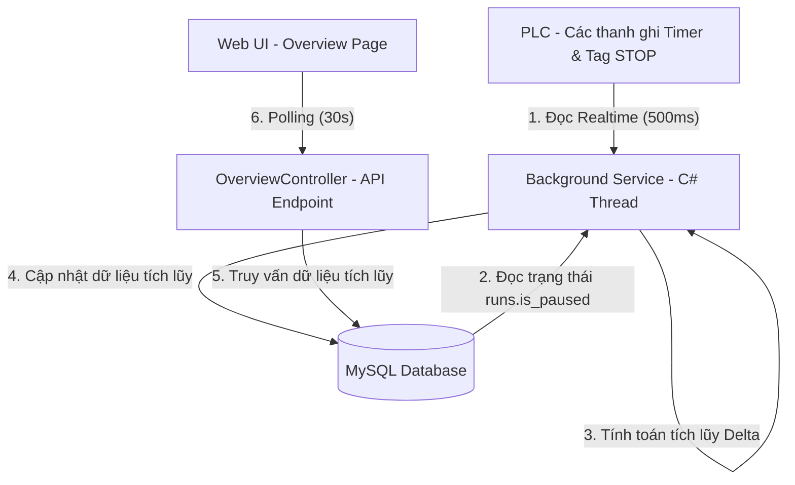
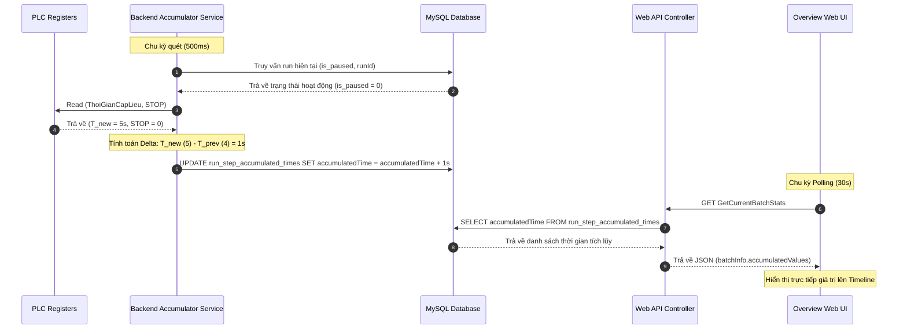

# Thiết kế Kỹ thuật (Technical Design Document)

## 1. Tổng quan (Overview)

### Mục đích (Purpose)
Tài liệu này thiết kế giải pháp C# Backend Background Service nhằm tích lũy và đồng bộ hóa thời gian chạy thực tế của các công đoạn mẻ sản xuất trên trang Tổng quan (Overview). Giải pháp này thay thế cơ chế tính toán tích lũy cũ chạy ở phía Client-side JavaScript để giải quyết triệt để lỗi sai lệch số liệu và trễ hiển thị khi mẻ bị Tạm dừng/Chạy tiếp (Pause/Resume).

### Người dùng (Users)
* **Người vận hành hệ thống (Operators)**: Xem được thời gian chạy thực tế chính xác của từng công đoạn trên màn hình Tổng quan mà không bị lệch số khi nhấn dừng/chạy tiếp.
* **Người quản lý chất lượng / Quản trị viên (QA/Admin)**: Có dữ liệu thời gian thực tế đã tích lũy chính xác lưu dưới Database để phục vụ xuất báo cáo lô (BPR).

### Phạm vi ảnh hưởng (Impact)
* **Cơ sở dữ liệu (MySQL)**: Bổ sung bảng lưu trữ phụ `run_step_accumulated_times` để lưu trữ thời gian tích lũy theo từng lần chạy (`runId`) và mã công đoạn (`stepCode`).
* **Backend (C#)**: Bổ sung một dịch vụ chạy ngầm khởi chạy cùng Web App để liên tục quét thanh ghi PLC, thực hiện tính delta và cập nhật Database.
* **API (C#)**: Thay đổi endpoint `GetCurrentBatchStats` để trả về dữ liệu tích lũy trực tiếp từ bảng cơ sở dữ liệu phụ thay vì tính toán động.
* **Frontend (JS)**: Loại bỏ logic tích lũy phức tạp trong `getJsAccumulatedValue`, chỉ nhận giá trị hiển thị trực tiếp từ API.

### Mục tiêu (Goals)
* **Mục tiêu 1**: Tính toán tích lũy thời gian chạy thực tế của từng công đoạn với sai số tối đa nhỏ hơn 1 giây trên toàn bộ vòng đời của mẻ.
* **Mục tiêu 2**: Nhận diện trạng thái Tạm dừng (Pause) của mẻ con dựa trên cờ `is_paused` từ database hoặc tag `STOP` của PLC để loại bỏ hoàn toàn các lỗi mất gói tin reset của PLC.
* **Mục tiêu 3**: Không gây tải nặng cho CPU của máy chủ Web (tần số quét PLC tối ưu ở mức 500ms).

### Phi mục tiêu (Non-Goals)
* Không thay đổi cấu trúc lưu trữ của bảng lịch sử gốc `alarmreport`.
* Không thay đổi chương trình điều khiển logic trong PLC.
* Không thay đổi giao diện trực quan hay CSS của Timeline công đoạn trên trang web.

---

## 2. Kiến trúc (Architecture)

### Sơ đồ luồng hoạt động (Architecture Pattern & Boundary Map)



* **Cơ chế tách biệt miền**: 
  * Background Service chịu trách nhiệm **thu thập** và **tính toán** dữ liệu.
  * Database chịu trách nhiệm **lưu trữ** trạng thái tích lũy.
  * Controller chỉ làm nhiệm vụ **đọc** và **trả về** dữ liệu qua API.
  * Web Client chỉ làm nhiệm vụ **hiển thị** dữ liệu số thực tế mà không tự tính toán delta.

### Công nghệ sử dụng (Technology Stack)

| Tầng (Layer) | Lựa chọn / Phiên bản | Vai trò | Ghi chú |
|---|---|---|---|
| **Backend / Services** | C# (.NET Framework 4.7.2) | `BackendTimerAccumulator` (Static Thread-based Service) | Khởi chạy tại `Application_Start` |
| **Data / Storage** | MySQL Server 5.6+ | Bảng `run_step_accumulated_times` | Chứa dữ liệu tích lũy |
| **PLC Driver** | `ATSCADAServiceClient` (WCF) | Đọc trực tiếp các tag PLC qua WCF | Sử dụng `RealtimeService` hiện có |

---

## 3. Luồng hệ thống (System Flows)

### Biểu đồ Sequence xử lý Tích lũy & Resume



---

## 4. Ma trận truy vết yêu cầu (Requirements Traceability)

| Mã Yêu cầu | Tóm tắt yêu cầu | Thành phần thiết kế | Giao diện lớp / API | Luồng xử lý |
|---|---|---|---|---|
| **2.1** | Quét dữ liệu thời gian thực từ PLC | `BackendTimerAccumulator` | `RealtimeService.Instance.Read` | Bước 1 trong sơ đồ kiến trúc |
| **2.2** | Thuật toán tích lũy kết hợp dừng mẻ | `BackendTimerAccumulator` | Bộ nhớ đệm in-memory và cờ chuyển trạng thái | Luồng Sequence xử lý |
| **2.3** | Lưu trữ dữ liệu tích lũy vào CSDL | Bảng `run_step_accumulated_times` | Thực thi các câu lệnh SQL UPDATE/INSERT | Bước 4 trong sơ đồ kiến trúc |
| **2.4** | Đồng bộ hiển thị lên giao diện Web | `OverviewController` | Endpoint `/Overview/GetCurrentBatchStats` | Bước 5-6 trong sơ đồ kiến trúc |

---

## 5. Các Thành phần và Giao diện (Components and Interfaces)

### Lớp Dịch vụ `BackendTimerAccumulator`

Lớp dịch vụ tĩnh chịu trách nhiệm chạy ngầm để quét và tích lũy dữ liệu.

```csharp
namespace LongDucProjectTest.Service
{
    public class BackendTimerAccumulator
    {
        private static readonly BackendTimerAccumulator _instance = new BackendTimerAccumulator();
        public static BackendTimerAccumulator Instance => _instance;

        private Thread _workerThread;
        private bool _isRunning;
        private Dictionary<int, double> _prevTimerValues = new Dictionary<int, double>();
        private int _lastRunId = -1;
        private bool _wasPaused = false;

        private BackendTimerAccumulator() {}

        public void Start();
        public void Stop();
        private void WorkerLoop();
        private void ProcessAccumulation(int runId, bool isPaused);
    }
}
```

* **Preconditions**: Dịch vụ `ATSCADAService` chạy trên localhost cổng 8010/8011 phải hoạt động để `RealtimeService` kết nối được.
* **Concurrency Strategy**: Sử dụng luồng chạy riêng biệt (`Thread`) độc lập với luồng xử lý HTTP request của IIS để không gây khóa hoặc nghẽn cổ chai cho ứng dụng.

---

## 6. Mô hình dữ liệu (Data Models)

### Bảng Cơ sở dữ liệu vật lý `run_step_accumulated_times`

```sql
CREATE TABLE `run_step_accumulated_times` (
  `runId` INT(11) NOT NULL,
  `stepCode` INT(11) NOT NULL,
  `accumulatedTime` DOUBLE NOT NULL DEFAULT 0,
  PRIMARY KEY (`runId`, `stepCode`),
  FOREIGN KEY (`runId`) REFERENCES `runs`(`id`) ON DELETE CASCADE
) ENGINE=InnoDB DEFAULT CHARSET=utf8;
```

---

## 7. Xử lý lỗi (Error Handling)

### Chiến lược xử lý lỗi
* **Lỗi mất kết nối PLC (WCF Connection Fault)**: 
  * Khi gọi `RealtimeService.Instance.Read` gặp ngoại lệ, ghi nhận vào file log, gán giá trị đọc được chu kỳ này bằng chu kỳ trước để không làm sai lệch tính toán tích lũy, và tiến hành khởi động lại kết nối WCF ở chu kỳ sau.
* **Lỗi mất kết nối Database**:
  * Nếu không ghi được dữ liệu tích lũy xuống MySQL, dịch vụ ngầm sẽ giữ giá trị tích lũy tạm thời trong bộ nhớ đệm (in-memory cache) và thử ghi lại ở chu kỳ tiếp theo (Retry pattern).

---

## 8. Chiến lược kiểm thử (Testing Strategy)

### Kiểm thử đơn vị (Unit Tests)
* Kiểm tra thuật toán tính toán tích lũy với các mốc dữ liệu giả lập đầu vào của PLC:
  * Đi kèm trường hợp chạy liên tục: `T_prev = 5, T_new = 6` $\rightarrow$ `Delta = 1`.
  * Đi kèm trường hợp reset: `T_prev = 15, T_new = 0` $\rightarrow$ `Delta = 0` (nếu có tín hiệu dừng).
  * Đi kèm trường hợp trễ mạng: `T_prev = 15, T_new = 3` (trạng thái vừa resume) $\rightarrow$ `Delta = 3`.

### Kiểm thử tích hợp (Integration Tests)
* Chạy thử Background Service song song với ứng dụng web, thực hiện đổi trạng thái `is_paused` trực tiếp dưới database và kiểm tra xem Background Service có dừng tích lũy tương ứng hay không.
