# Design Document: Báo cáo Lô sản xuất (Batch Production Record) Export

---
**Purpose**: Hướng dẫn chi tiết thiết kế kỹ thuật và giải pháp triển khai chức năng xuất báo cáo Excel Nhật ký sản xuất (BPR) từ trang Event (Batches).
**Approach**: 
- Sử dụng phương pháp đọc file mẫu Excel làm template và điền dữ liệu động bằng thư viện EPPlus.
- Thiết kế thuật toán chèn dòng động cho BOM nguyên vật liệu và nhân bản bảng động cho nhiều mẻ con (runs).
---

## Overview

### Purpose
Tính năng này cung cấp khả năng xuất báo cáo Nhật ký sản xuất dạng file Excel (.xlsx) chuẩn chỉnh theo mẫu [structure_batch_export.xlsx](file:///c:/Users/tanhv/Project/WebApp_LongDuc_22012025Phase2/WebApp_LongDuc_22012025Phase2/docs/structure_batch_export.xlsx) đã được cung cấp. Báo cáo này tổng hợp toàn bộ thông tin của một lô sản xuất (Batch) bao gồm thông tin hành chính, danh sách nguyên vật liệu sử dụng (BOM) và thông số vận hành chi tiết của tất cả các mẻ con (Runs) được SCADA ghi nhận.

### Users
- **Admin / QC / Quản lý sản xuất**: Sử dụng chức năng này để xuất báo cáo, ký số / lưu trữ hồ sơ lô sản xuất phục vụ việc truy xuất nguồn gốc và kiểm tra chất lượng.

### Impact
- Bổ sung thêm API xuất báo cáo `/Event/ExportBatchRecordExcel` trong `EventController.cs`.
- Bổ sung thêm lớp nghiệp vụ `BatchRecordExportService.cs` đảm nhận việc truy vấn dữ liệu và thao tác trực tiếp trên Excel template bằng EPPlus.
- Bổ sung nút bấm "Export BPR" trên thanh công cụ lọc của trang Event (`Views/Home/Event.cshtml`).

### Goals
- Xuất file Excel giữ nguyên 100% định dạng của file mẫu (merge cell, border, font, color, column width).
- Hỗ trợ số lượng nguyên vật liệu đầu vào động (tự động chèn dòng và copy style).
- Hỗ trợ số lượng mẻ con động (tự động nhân bản bảng thông số 8 công đoạn cho từng mẻ con).
- Tên file xuất chuẩn format: `batch_record_{batch_id}_{yyyyMMdd}.xlsx`.

### Non-Goals
- Hệ thống không hỗ trợ sửa đổi trực tiếp dữ liệu từ file Excel (chỉ hỗ trợ xuất báo cáo tĩnh).
- Hệ thống không sinh lại file Excel từ đầu bằng code (bắt buộc dùng template Excel).

---

## Architecture

### Existing Architecture Analysis
Dự án là ứng dụng **ASP.NET MVC 5** chạy trên **.NET Framework 4.7.2**.
- Cơ sở dữ liệu sử dụng **MySQL** được truy vấn thông qua class helper `Hino.DatabaseConnector.MySQLConnect`.
- Thư viện xử lý Excel là **EPPlus 5+** đã được cài đặt và nhập khẩu trong các Controller bằng `using OfficeOpenXml;`.
- Hiện tại đã có class `ExportUtility.cs` hỗ trợ xuất danh sách phẳng ra Excel, tuy nhiên không hỗ trợ xuất theo template phức tạp. Vì vậy, ta cần xây dựng một Service riêng biệt để xử lý nghiệp vụ điền dữ liệu vào template.

### Architecture Pattern & Boundary Map

```mermaid
sequenceDiagram
    autonumber
    Actor Admin as Admin User
    participant Browser as Web Browser (Event Page)
    participant Ctrl as EventController
    participant Service as BatchRecordExportService
    participant DB as MySQL Database
    participant Template as Excel Template File

    Admin->>Browser: Click "Export BPR" Button
    Browser->>Ctrl: GET /Event/ExportBatchRecordExcel?batchId=1
    Note over Ctrl: Validate Admin Session
    Ctrl->>Service: ExportBatchRecord(batchId: 1)
    
    rect rgb(30, 41, 59)
        Note over Service: 1. Read Template File
        Service->>Template: Load docs/structure_batch_export.xlsx
        Template-->>Service: Return ExcelPackage
        
        Note over Service: 2. Query Database
        Service->>DB: Query batch details, runs, run_info, webhook_logs
        DB-->>Service: Return DataTables / Payload
        
        Note over Service: 3. Parse Webhook & BOM
        Note over Service: 4. Populate Section 1 (Header)
        Note over Service: 5. Populate Section 2 (BOM) & Insert Rows
        Note over Service: 6. Populate Section 3 (Runs) & Duplicate Blocks
        Note over Service: 7. Clean up other sheets
    end

    Service-->>Ctrl: Return byte[] (Excel file bytes)
    Ctrl-->>Browser: FileResult (batch_record_1_20260609.xlsx)
    Browser->>Admin: Trigger Browser File Download
```



### Technology Stack

| Layer | Choice / Version | Role in Feature | Notes |
|:---|:---|:---|:---|
| Frontend | HTML / Vanilla JS / Bootstrap 3 | Thêm nút bấm trên trang Event | Tích hợp vào `Views/Home/Event.cshtml` |
| Backend | C# 6.0 / ASP.NET MVC 5 | API Controller & Service xử lý | `EventController.cs`, `BatchRecordExportService.cs` |
| Excel Lib | EPPlus 5.x+ | Đọc, chèn dòng, clone style, điền dữ liệu Excel | Sử dụng `LicenseContext.NonCommercial` |
| Database | MySQL 5.6+ | Lưu trữ batches, runs, run_info, webhook_logs | Truy vấn bằng `MySQLConnect` |

---

## Requirements Traceability

| Requirement | Summary | Components | Interfaces | Flows |
|:---|:---|:---|:---|:---|
| **1.1** | Sử dụng file mẫu làm template | `BatchRecordExportService` | `IBatchRecordExportService` | Đọc file template từ `docs/` |
| **1.2** | Giữ nguyên format gốc | `BatchRecordExportService` | `IBatchRecordExportService` | Dùng cơ chế clone cell style và merge cell của EPPlus |
| **1.3** | Tên file export chuẩn hóa | `EventController` | `ExportBatchRecordExcel` | Sinh tên file theo định dạng chuẩn |
| **2.1** | Lấy dữ liệu từ `webhook_logs` | `BatchRecordExportService` | `IBatchRecordExportService` | Lọc `webhook_logs` bằng `received_at = created_at` |
| **2.2** | Điền thông tin chung (Section 1) | `BatchRecordExportService` | `IBatchRecordExportService` | Điền các ô tọa độ cố định Row 5 - Row 9 |
| **3.1** | Lấy dữ liệu BOM đầu vào | `BatchRecordExportService` | `IBatchRecordExportService` | Giải mã Base64 và parse JSON BOM từ webhook |
| **3.2** | Điền thông tin vật tư đầu vào | `BatchRecordExportService` | `IBatchRecordExportService` | Điền dữ liệu vào các cột tương ứng Section 2 |
| **3.3** | Chèn dòng động cho BOM | `BatchRecordExportService` | `IBatchRecordExportService` | Thuật toán `InsertRow` và sao chép style của EPPlus |
| **4.1** | Đọc danh sách mẻ con | `BatchRecordExportService` | `IBatchRecordExportService` | Truy vấn danh sách `runs` thuộc batch |
| **4.2** | Hiển thị 8 công đoạn cho mỗi run | `BatchRecordExportService` | `IBatchRecordExportService` | Điền dữ liệu cho 8 dòng của từng mẻ con |
| **4.3** | Nhân bản bảng thông số cho Run > 2 | `BatchRecordExportService` | `IBatchRecordExportService` | Thuật toán clone block 9 dòng của Mẻ 2 |
| **4.4** | Lấy thông số quá trình và nhiệt độ | `BatchRecordExportService` | `IBatchRecordExportService` | Truy vấn `alarmreport` và `alarmlog` theo khoảng thời gian |
| **5.2** | Điền sự cố phát sinh | `BatchRecordExportService` | `IBatchRecordExportService` | Truy vấn `realtime_alarms` lọc theo mức độ 'ALARM' |
| **6.1** | Giao diện hiển thị theo quyền Admin | `Event.cshtml` | View logic | Kiểm tra `Session["Role"]` ẩn/hiển thị nút |
| **6.2** | Kích hoạt tải file Excel | `Event.cshtml` | JS function `ExportBatchRecord` | Gọi API endpoint tải file |

---

## Components and Interfaces

### Component Summary

| Component | Layer | Intent | Req Coverage | Key Dependencies | Contracts |
|:---|:---|:---|:---|:---|:---|
| **`EventController`** | Controller | Tiếp nhận yêu cầu từ client, kiểm tra quyền và trả về file Excel | 1.3, 6.1, 6.2 | `IBatchRecordExportService`, `MySQLConnect` | HTTP GET API |
| **`BatchRecordExportService`** | Service | Xử lý logic nghiệp vụ chính: đọc DB, giải mã BOM, nạp template và điền Excel | 1.1, 1.2, 2.1, 2.2, 3.1-3.3, 4.1-4.4, 5.1-5.3 | `MySQLConnect`, `OfficeOpenXml` | C# Interface |

---

### Backend Component Detail

#### `EventController`
- **Intent**: Controller xử lý các sự kiện trang Batches/Event, bổ sung API Endpoint xuất báo cáo BPR.
- **Requirements**: 1.3, 6.1, 6.2
- **Contracts**:
  - **API Contract**:
    - Method: `GET`
    - Endpoint: `/Event/ExportBatchRecordExcel`
    - Parameter: `string batchId`
    - Response: `FileResult` (MimeType: `application/vnd.openxmlformats-officedocument.spreadsheetml.sheet`)
    - Errors: 
      - `403 Forbidden` (Nếu không phải Admin)
      - `400 Bad Request` (Nếu thiếu hoặc sai format `batchId`)
      - `404 Not Found` (Nếu không tìm thấy Batch tương ứng)

```csharp
[HttpGet]
public ActionResult ExportBatchRecordExcel(string batchId)
{
    if (Session["Role"] is null || (int)Session["Role"] != (int)Role.Admin)
    {
        return new HttpStatusCodeResult(System.Net.HttpStatusCode.Forbidden, "Bạn không có quyền thực hiện hành động này.");
    }

    if (string.IsNullOrEmpty(batchId) || !int.TryParse(batchId, out int id) || id <= 0)
    {
        return new HttpStatusCodeResult(System.Net.HttpStatusCode.BadRequest, "Mã Batch không hợp lệ.");
    }

    try
    {
        var connector = new Hino.DatabaseConnector.MySQLConnect()
        {
            ConnectionString = "Server=localhost;Database=scada;Uid=root;Pwd=101101;CharSet=utf8;"
        };

        var exportService = new LongDucProjectTest.Service.BatchRecordExportService(connector, Server.MapPath("~/docs/structure_batch_export.xlsx"));
        byte[] fileBytes = exportService.ExportBatchRecord(id, out string fileName);

        return File(fileBytes, "application/vnd.openxmlformats-officedocument.spreadsheetml.sheet", fileName);
    }
    catch (FileNotFoundException ex)
    {
        return HttpNotFound(ex.Message);
    }
    catch (Exception ex)
    {
        return new HttpStatusCodeResult(System.Net.HttpStatusCode.InternalServerError, "Lỗi hệ thống: " + ex.Message);
    }
}
```

#### `BatchRecordExportService`
- **Intent**: Service chịu trách nhiệm xử lý logic chính về nạp template, truy vấn dữ liệu từ MySQL và ghi đè dữ liệu lên file Excel thông qua EPPlus.
- **Requirements**: 1.1, 1.2, 2.1, 2.2, 3.1-3.3, 4.1-4.4, 5.1-5.3
- **Contracts**:
  - **Service Interface**:

```csharp
namespace LongDucProjectTest.Service
{
    public interface IBatchRecordExportService
    {
        /// <summary>
        /// Thực hiện xuất báo cáo Batch Production Record sang mảng byte.
        /// </summary>
        /// <param name="batchId">Mã định danh Batch cần xuất</param>
        /// <param name="fileName">Tên file output được sinh ra</param>
        /// <returns>Mảng byte của file Excel kết quả</returns>
        byte[] ExportBatchRecord(int batchId, out string fileName);
    }
}
```

- **Giải thuật xử lý chi tiết trong Service**:
  1. **Load Template**: Đọc file `structure_batch_export.xlsx` bằng `ExcelPackage`. Mở worksheet có tên là `Sheet1`.
  2. **Query Batch**: Lấy thông tin chung của Batch từ bảng `batches` (Tên, ngày, thiết bị, trạng thái, thời gian chạy).
  3. **Parse Webhook**: Lấy bản ghi `webhook_logs` có `received_at = batches.created_at`. Parse payload lấy các thông số:
     - `custom_ten_hang_hoa` -> Tên sản phẩm
     - `custom_ma_dinh_danh` -> Mã hàng FG
     - `custom_lotno` -> Mã lô FG, Mã mẫu lưu
     - `custom_ke_hoach_san_xuat` -> Lệnh sản xuất
     - `custom_ngay_san_xuat` -> Ngày sản xuất
     - `custom_quy_cach` -> Quy cách đóng gói
     - `custom_don_vi_tinh` -> ĐVT
     - `custom_khoi_luong_muc_tieu` -> Sản lượng kế hoạch
     - `custom_thong_tin_bom_san_xuat_a`, `_b`... -> Giải mã Base64 -> Parse JSON để lấy danh sách nguyên vật liệu của các mẻ con.
  4. **Điền Section 1**: Ghi trực tiếp các giá trị thông tin chung vào tọa độ ô cố định trên sheet (B5, E5, H5, B6, E6, H6, B7, E7, H7, B8, E8, H8, B9, E9, H9).
  5. **Điền Section 2 (BOM)**:
     - Đọc và gộp các nguyên vật liệu từ tất cả các mẻ con để tính tổng số lượng kế hoạch và thực tế theo từng mã nguyên liệu (hoặc hiển thị danh sách BOM chi tiết).
     - Nếu tổng số dòng nguyên vật liệu $M > 5$, thực hiện chèn thêm $M - 5$ dòng tại vị trí Row 18.
     - Viết hàm copy style (borders, fonts, alignment) của dòng 13 sang các dòng mới chèn.
     - Điền dữ liệu vào các dòng tương ứng.
  6. **Điền Section 3 (Runs/Mẻ con)**:
     - Xác định danh sách mẻ con từ bảng `runs` (`batch_id = selectedBatchId`).
     - Với mỗi run, xác định khoảng thời gian chạy của 8 công đoạn từ bảng `alarmlog` (lọc theo `runId` và `TagNo` từ `T001` đến `T008`).
     - Truy vấn `alarmreport` của mẻ con để tính toán dải nhiệt độ Min-Max cho các bồn trộn tương ứng với thời gian chạy từng công đoạn.
     - Lọc `realtime_alarms` để lấy cảnh báo.
     - *Nhân bản mẻ*: Nếu số mẻ con $N > 2$:
       - Xác định vị trí bắt đầu chèn bảng mới (vị trí cuối bảng mẻ $i-1$).
       - Chèn 9 dòng trống cho bảng mẻ mới.
       - Sao chép định dạng và text tiêu đề từ khối mẻ 2 (dòng 30-38) sang khối dòng mới chèn.
       - Thay đổi nhãn mẻ (ví dụ ô A30 ghi "Mẻ 2" thì ô của mẻ 3 ghi "Mẻ 3").
       - Điền thông số quá trình của mẻ mới vào khối vừa chèn.
     - Nếu số mẻ con $N = 1$: Xóa bỏ khối bảng của mẻ 2 (xóa Row 30 đến Row 38) để file báo cáo gọn gàng.
  7. **Điền các Section còn lại**:
     - Section 5 (QC Lô): Điền mặc định kết quả "Đạt" hoặc để trống cho ghi nhận.
     - Section 6 (Sự cố): Truy vấn các cảnh báo nghiêm trọng từ `realtime_alarms` và điền vào bảng. Nếu số lượng sự cố > 4 dòng mẫu, tự động chèn dòng tương tự BOM.
  8. **Clean up sheets**: Đổi tên `Sheet1` thành "Nhật ký sản xuất", xóa bỏ sheet `Nhat ky san xuat` và `Huong dan` để báo cáo chuyên nghiệp.
  9. **Save & Return**: Lưu `ExcelPackage` và trả về mảng byte.

- **Helper Method để Clone Cell Style trong EPPlus**:
```csharp
private void CopyRowStyles(ExcelWorksheet ws, int sourceRow, int destRow)
{
    ws.Row(destRow).Height = ws.Row(sourceRow).Height;
    for (int col = 1; col <= ws.Dimension.End.Column; col++)
    {
        var sourceCell = ws.Cells[sourceRow, col];
        var destCell = ws.Cells[destRow, col];
        destCell.Style.ID = sourceCell.Style.ID; // Clone nhanh bằng Style ID
    }
}
```

---

## Data Models

### Data Model Sufficiency
Tính năng này không yêu cầu tạo bảng dữ liệu mới mà chỉ đọc từ cấu trúc cơ sở dữ liệu hiện tại:
- Bảng `batches`: Lấy thông tin chung của lô sản xuất.
- Bảng `runs`: Lấy danh sách mẻ con thuộc lô.
- Bảng `run_info`: Lấy thông tin BOM thực tế đã đồng bộ.
- Bảng `webhook_logs`: Lấy payload thô từ Base để lấy thông số ban đầu và kế hoạch BOM.
- Bảng `alarmlog`: Lấy mốc thời gian bắt đầu và kết thúc của 8 công đoạn.
- Bảng `alarmreport`: Lấy giá trị đo nhiệt độ, áp suất thực tế theo chu kỳ giây.
- Bảng `realtime_alarms`: Lấy log cảnh báo sự cố phát sinh.

Do đó, **không có thay đổi về Data Schema**.

---

## Error Handling

### Error Strategy
Hệ thống sử dụng cơ chế bắt ngoại lệ (exception catching) ở tầng Controller để đảm bảo giao diện người dùng hiển thị thông báo lỗi thân thiện thay vì làm sập ứng dụng.

### Error Categories and Responses
- **Không tìm thấy file template mẫu (`FileNotFoundException`)**:
  - *Nguyên nhân*: File `docs/structure_batch_export.xlsx` bị xóa hoặc sai đường dẫn.
  - *Phản hồi*: Trả về mã lỗi HTTP 404 với thông điệp: "Không tìm thấy file mẫu báo cáo Nhật ký sản xuất tại thư mục docs/."
- **Không tìm thấy dữ liệu Webhook (`KeyNotFoundException`)**:
  - *Nguyên nhân*: Không có bản ghi nào trong `webhook_logs` có `received_at` khớp với `batches.created_at`.
  - *Phản hồi*: Hệ thống tự động ghi nhận cảnh báo vào log file, tiếp tục xuất file Excel nhưng sử dụng thông tin từ bảng `batches` và `run_info` để điền thay thế (các trường chỉ có trong webhook như Tên sản phẩm, Lệnh sản xuất sẽ hiển thị mặc định `-` hoặc giá trị từ database).
- **Lỗi định dạng dữ liệu BOM (`JsonException` / `FormatException`)**:
  - *Nguyên nhân*: Chuỗi BOM trong webhook không hợp lệ hoặc lỗi giải mã Base64.
  - *Phản hồi*: Điền trống phần danh sách nguyên vật liệu đầu vào và chèn dòng ghi chú "Lỗi dữ liệu BOM từ Webhook".
- **Lỗi thao tác file Excel (`InvalidOperationException`)**:
  - *Nguyên nhân*: File template đang bị khóa bởi tiến trình khác hoặc lỗi bộ nhớ EPPlus.
  - *Phản hồi*: Trả về lỗi HTTP 500: "Lỗi tạo file Excel: [Chi tiết lỗi]."

---

## Testing Strategy

### Unit Tests
- `TestParseWebhookPayload`: Kiểm tra hàm giải mã và phân tách payload URL-encoded từ bảng `webhook_logs`.
- `TestDecodeBase64BOM`: Kiểm tra hàm giải mã chuỗi Base64 BOM và chuyển đổi thành mảng JSON.
- `TestCopyRowStyles`: Kiểm tra hàm clone style dòng trong EPPlus, đảm bảo borders và background colors được copy chính xác sang dòng mới chèn.

### Integration Tests
- `TestExportWithSingleRun`: Kiểm tra xuất lô sản xuất chỉ có 1 mẻ con, xác nhận bảng mẻ 2 được xóa sạch và layout không bị vỡ.
- `TestExportWithMultipleRuns`: Kiểm tra xuất lô có 3 hoặc 4 mẻ con, kiểm tra tính năng nhân bản bảng công đoạn tự động và tính đúng đắn của dữ liệu mẻ con thứ 3 trở đi.
- `TestDynamicRowShiftingStyle`: Kiểm tra chèn thêm 15 dòng nguyên vật liệu đầu vào, verify vị trí của Section 3 tự động dịch chuyển xuống dòng đúng (dòng 31 trở đi) và giữ nguyên căn lề.

### UI / Manual Verification
- Người dùng Admin đăng nhập, vào trang Event `/Home/Event`.
- Chọn ngày, chọn Batch và chọn Mẻ con bất kỳ.
- Bấm nút "Export BPR", kiểm tra file tải xuống có tên dạng `batch_record_X_YYYYMMDD.xlsx`.
- Mở file bằng Microsoft Excel, kiểm tra định dạng hiển thị, đảm bảo không có cảnh báo lỗi cấu trúc file từ Excel, kiểm tra các ô điền dữ liệu chính xác và căn lề ngay ngắn.
- Kiểm tra tính đúng đắn của dải nhiệt độ bồn trên/giữa/dưới bằng cách đối chiếu với đồ thị trang Overview của mẻ con đó.
