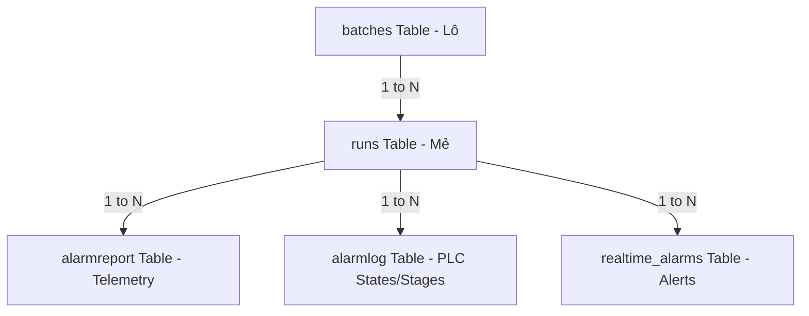

# Technical Design: Batch-Runs 1-N Upgrade

This document outlines the detailed technical specifications and architecture changes required to implement the **1 Batch = N Runs (Mẻ con)** model across the AFCHEM SCADA Web Application.

---

## 1. Architectural Overview & Data Flow

Previously, the system associated PLC telemetry, alarms, and stages directly with a `batchId` under a 1-to-1 assumption. In the new model, a **Batch** represents the administrative lot (e.g. `TX01-20260601-01`), whereas a **Run** represents the physical execution cycle (e.g. `TX01-20260601-01-Run01`).



### Data Flow during UI operation:
1. **Live View (Active Run)**: 
   - Polling AJAX fetches live stats for the active run: `GET /Overview/GetCurrentBatchStats` (without parameter, defaults to active run).
   - Real-time data from OPC/PLC (ATScada-task) updates the telemetry card values and gauges on the Mixer Diagram.
2. **Historic View (Completed Run)**:
   - Polling stops. A `HISTORIC VIEW` overlay is placed on the Mixer Diagram.
   - Operator clicks tab `Run 01`. AJAX request: `GET /Overview/GetCurrentBatchStats?runId=selectedRunId`.
   - Backend queries SQL tables filtered strictly by `runId = selectedRunId` and returns the historical telemetry, stages, and step alarms.
   - UI updates all charts, 8-stage progress table, and stats panel using the returned static data. ATScada live tag dispatchers are temporarily disconnected/ignored to prevent confusing live values from overriding historic records on the Mixer Diagram.

---

## 2. Database Schema Details

As implemented in the backend migration:
- **`batches`**: Added column `total_runs` `INT NOT NULL DEFAULT 1`.
- **`runs`**: New table referencing `batches(id)`:
  - `id` (INT Auto-Increment, Primary Key)
  - `batch_id` (INT, Foreign Key referencing `batches(id)`)
  - `run_number` (INT, e.g. 1, 2)
  - `name` (VARCHAR(150), Unique, e.g. `TX01-20260601-01-Run01`)
  - `status` (VARCHAR(50), Default `'Pending'`, supports `'Active'`, `'Completed'`)
  - `start_time` / `end_time` / `created_at`
- **`alarmreport` / `alarmlog` / `realtime_alarms`**: Added column `runId` `INT NULL` (Foreign Key referencing `runs(id)`).

---

## 3. Backend Implementation (Controllers)

To support this model, we must update the MVC controllers:

### 3.1. `OverviewController.cs` Upgrades

#### 1. Method `GetCurrentBatchStats` Update:
Accepts a new optional parameter `int? runId`.
```csharp
[HttpGet]
public JsonResult GetCurrentBatchStats(int? runId = null)
{
    // ...
}
```
**Resolution Logic:**
- If `runId` has a value:
  - Fetch that run: `SELECT * FROM runs WHERE id = {runId}`.
  - Obtain its `batch_id` to query batch metadata (`batches` table).
- If `runId` is null/omitted:
  - Find the active batch: `SELECT * FROM batches WHERE status = 'Active' LIMIT 1`.
  - Under this batch, find the active run: `SELECT * FROM runs WHERE batch_id = {activeBatchId} AND status = 'Active' LIMIT 1`.
  - If no active run, fallback to the latest run of that batch: `SELECT * FROM runs WHERE batch_id = {activeBatchId} ORDER BY run_number DESC LIMIT 1`.
  - If no active batch exists, fallback to the most recently completed batch, and default to its latest run.

**Query Updates (Filtering by `runId`):**
Replace the old `batchId` queries with `runId` queries:
- **alarmlog**: `SELECT OccurrenceTime, RestoreTime, Description, Status, TagNo FROM alarmlog WHERE runId = {resolvedRunId}`
- **alarmreport**: `SELECT DateTime, NhietDoBonTronTren, NhietDoBonTronGiua, NhietDoBonTronDuoi FROM alarmreport WHERE runId = {resolvedRunId} ORDER BY DateTime ASC`
- **realtime_alarms**: `SELECT id, DateTime, CongDoan, Severity, TagName, Value, Threshold, Message FROM realtime_alarms WHERE runId = {resolvedRunId} AND Severity IN ('ALARM', 'WARNING') ORDER BY DateTime ASC, id ASC`

**Batch Metadata Return Payload:**
Return the list of all runs under the selected Batch to populate the tab selector:
```csharp
var dtRuns = connector.ExecuteQuery($"SELECT id, run_number, name, status FROM runs WHERE batch_id = {resolvedBatchId} ORDER BY run_number ASC");
// Map to runs list in the JSON response
```

#### 2. Method `GetRecentAlarms` Update:
- Must query by the active `runId` instead of the active `batchId` to display alarms for the currently running mẻ con in the alarms panel:
```csharp
// Resolve active run id
var dtActiveRun = connector.ExecuteQuery("SELECT id FROM runs WHERE status = 'Active' LIMIT 1");
// ... query realtime_alarms WHERE runId = activeRunId
```

---

### 3.2. `AlarmController.cs` & `EventController.cs` Upgrades

- Enhance endpoints `GetAlarmsData`, `GetAlarmReportData`, `GetEventLogRealtime` to accept an optional parameter `int? runId`.
- If `runId` is provided, the queries filter strictly by `runId = @runId`.
- Add an API endpoint `GET /api/runs?batch_id=xxx` returning the runs belonging to a batch:
```csharp
[HttpGet]
public JsonResult GetRunsByBatch(int batchId)
{
    var connector = new MySQLConnect() { ConnectionString = "..." };
    var dt = connector.ExecuteQuery($"SELECT id, name, status FROM runs WHERE batch_id = {batchId} ORDER BY run_number ASC");
    // return Json(list, AllowGet)
}
```

---

## 4. Frontend Implementation (Views & JavaScript)

### 4.1. Overview Page (`Overview.cshtml`) UI Upgrades

We will create a premium **Tab Selector** inside the "TỔNG QUAN BATCH" or directly above the "Thống kê mẻ hiện tại" panel:

#### HTML Addition (Tab Selector Container):
```html
<!-- Inside Overview.cshtml above table-responsive -->
<div class="run-selector-container mb-3">
    <div class="run-selector-title text-cyan"><i class="fas fa-microchip"></i> MẺ SẢN XUẤT (RUNS):</div>
    <div class="run-selector-tabs" id="runTabsContainer">
        <!-- Rendered dynamically via JavaScript -->
    </div>
</div>
```

#### Premium Glassmorphism CSS Styles (`Overview.css` or style block):
```css
.run-selector-container {
    background: rgba(15, 23, 42, 0.45);
    backdrop-filter: blur(10px);
    border: 1px solid rgba(255, 255, 255, 0.05);
    border-radius: 8px;
    padding: 12px 20px;
    display: flex;
    align-items: center;
    gap: 15px;
}
.run-selector-title {
    font-weight: bold;
    font-size: 13px;
    letter-spacing: 0.5px;
    text-transform: uppercase;
}
.run-selector-tabs {
    display: flex;
    gap: 10px;
    flex-wrap: wrap;
}
.run-tab {
    padding: 8px 16px;
    border-radius: 6px;
    font-size: 13px;
    font-weight: 600;
    cursor: pointer;
    transition: all 0.25s cubic-bezier(0.4, 0, 0.2, 1);
    background: rgba(255, 255, 255, 0.03);
    border: 1px solid rgba(255, 255, 255, 0.08);
    color: #94a3b8;
    display: flex;
    align-items: center;
    gap: 8px;
    box-shadow: 0 4px 6px -1px rgba(0, 0, 0, 0.1);
}
.run-tab:hover {
    background: rgba(255, 255, 255, 0.08);
    border-color: rgba(255, 255, 255, 0.15);
    color: #fff;
    transform: translateY(-1px);
}
/* Selected state */
.run-tab.selected {
    color: #fff;
    box-shadow: 0 0 15px rgba(59, 130, 246, 0.3);
}
.run-tab.selected.Active {
    background: linear-gradient(135deg, #00c6ff, #0072ff);
    border-color: #00c6ff;
}
.run-tab.selected.Completed {
    background: linear-gradient(135deg, #10b981, #059669);
    border-color: #10b981;
}
.run-tab.selected.Pending {
    background: linear-gradient(135deg, #4b5563, #374151);
    border-color: #4b5563;
}
/* Status badges on tab */
.run-tab-badge {
    padding: 2px 6px;
    border-radius: 4px;
    font-size: 10px;
    font-weight: bold;
    text-transform: uppercase;
}
.run-tab.Active .run-tab-badge { background: rgba(0, 229, 255, 0.2); color: #00e5ff; }
.run-tab.Completed .run-tab-badge { background: rgba(16, 185, 129, 0.2); color: #10b981; }
.run-tab.Pending .run-tab-badge { background: rgba(148, 163, 184, 0.2); color: #94a3b8; }
```

### 4.2. Overview JavaScript Controller (`OverviewRealtime.js`) Upgrades

#### 1. Tracking State Variables:
```javascript
var selectedRunId = null;  // Stores currently selected run ID on UI
var activeRunId = null;    // Stores actual running mẻ con ID in house
var isHistoricView = false; // Flag to enable/disable SCADA tag overrides
```

#### 2. Tab Rendering inside `fetchCurrentBatchStats` Success:
```javascript
// Inside Success Callback:
if (data && data.batchInfo && data.batchInfo.runs) {
    var runs = data.batchInfo.runs;
    var activeRun = runs.find(r => r.status === 'Active');
    
    // Auto-select resolved active run on initial load
    if (selectedRunId === null) {
        selectedRunId = activeRun ? activeRun.id : (runs.length > 0 ? runs[runs.length - 1].id : null);
        activeRunId = activeRun ? activeRun.id : null;
        isHistoricView = (selectedRunId !== activeRunId);
    }

    renderRunTabs(runs, selectedRunId);
}
```

#### 3. Tab Switching Logic:
```javascript
function renderRunTabs(runs, currentSelectedId) {
    var container = document.getElementById("runTabsContainer");
    if (!container) return;
    
    var html = '';
    runs.forEach(function(run) {
        var isSelected = (run.id === currentSelectedId);
        var selectClass = isSelected ? 'selected ' + run.status : '';
        
        html += '<div class="run-tab ' + selectClass + '" onclick="switchRun(' + run.id + ', ' + (run.status === 'Active') + ')">' +
                    '<span>Mẻ ' + run.run_number + '</span>' +
                    '<span class="run-tab-badge">' + run.status + '</span>' +
                '</div>';
    });
    container.innerHTML = html;
}

window.switchRun = function(runId, isActive) {
    if (selectedRunId === runId) return;
    
    selectedRunId = runId;
    isHistoricView = !isActive;
    
    // Visual effects for switcher
    var mixerDiagram = document.querySelector('.tank-diagram-container');
    if (isHistoricView) {
        // Apply gray tint/blur or historical indicator
        mixerDiagram.classList.add('historic-mode');
        if (!document.getElementById("historicBadge")) {
            var badge = document.createElement("div");
            badge.id = "historicBadge";
            badge.className = "historic-overlay-badge";
            badge.innerHTML = "<i class='fas fa-history'></i> XEM LẠI DỮ LIỆU LỊCH SỬ";
            mixerDiagram.appendChild(badge);
        }
    } else {
        mixerDiagram.classList.remove('historic-mode');
        var badge = document.getElementById("historicBadge");
        if (badge) badge.remove();
    }
    
    // Instantly trigger data fetch for selected run
    fetchCurrentBatchStatsForRun(selectedRunId);
}
```

#### 4. Disabling SCADA Live Overrides for Historic Views:
In the `dispatcher.on('valueChanged')` logic:
```javascript
if (isHistoricView) {
    return; // Block OPC/PLC SCADA values from overwriting historic telemetry on the UI!
}
```

---

### 4.3. Alarm/Event/Report Filters UI Upgrades

We will write JavaScript filters dynamically. Below is the cascading flow:
1. **Cascade Load**:
```javascript
$("#batchFilter").on("change", function() {
    var batchId = $(this).val();
    var runSelect = $("#runFilter");
    
    if (!batchId) {
        runSelect.val("").prop("disabled", true);
        return;
    }
    
    $.ajax({
        url: "/api/runs?batch_id=" + batchId,
        type: "GET",
        success: function(data) {
            runSelect.empty().append('<option value="">-- Tất cả Mẻ --</option>');
            data.forEach(function(run) {
                runSelect.append('<option value="' + run.id + '">' + run.name + '</option>');
            });
            runSelect.prop("disabled", false);
        }
    });
});
```

2. **Autocomplete Search Bar Integration**:
Using standard jQuery-UI or dynamic datalist:
```html
<input type="text" id="runSearchInput" placeholder="Nhập mã mẻ (VD: TX01-20260601-01-Run01)..." class="form-control" />
```
```javascript
$("#runSearchInput").autocomplete({
    source: "/api/search_runs", // Search endpoint returning { label: "run_name", value: "run_id", batch_id: "batch_id" }
    select: function(event, ui) {
        $("#batchFilter").val(ui.item.batch_id).trigger("change");
        // Delay to let cascading populate
        setTimeout(function() {
            $("#runFilter").val(ui.item.value);
            // Auto trigger grid search
            $("#btnFilter").click();
        }, 300);
    }
});
```
