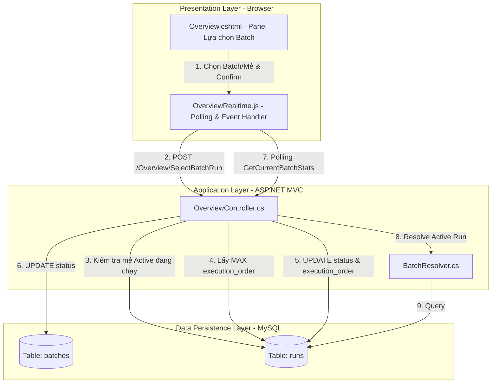
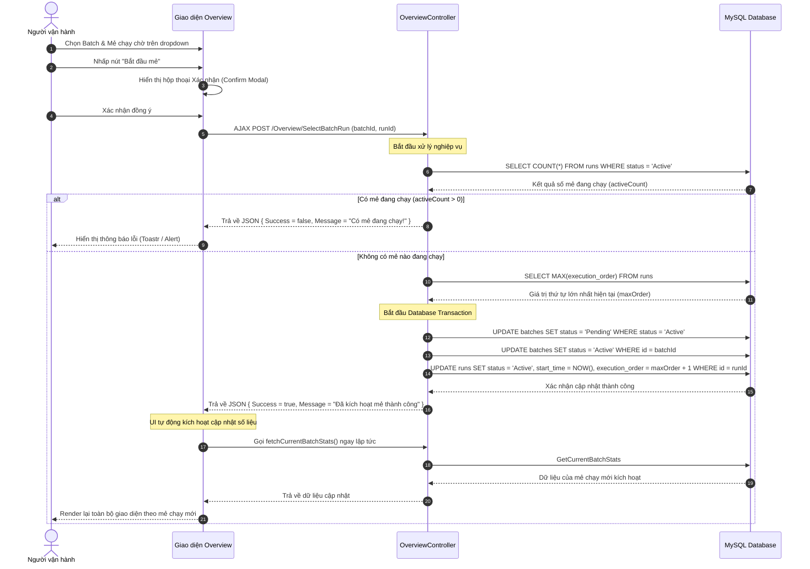

# Tài liệu Thiết kế Kỹ thuật (Technical Design Document)

---

**Mục đích**: Mô tả chi tiết giải pháp thiết kế kỹ thuật cho tính năng Lựa chọn Batch Chạy Linh hoạt (flexible-batch-execution), đảm bảo tính nhất quán trong triển khai và tích hợp mượt mà vào hệ thống SCADA hiện tại.

---

## 1. Tổng quan (Overview)

### Mục đích (Purpose)
Tính năng này cung cấp khả năng lựa chọn linh hoạt mẻ chạy (run) tiếp theo từ các lệnh sản xuất (batch) đang ở trạng thái chờ (standby), cho phép thay đổi thứ tự sản xuất theo nhu cầu thực tế của nhà máy mà không bị ràng buộc bởi trình tự tạo lệnh ban đầu.

### Người dùng (Users)
- **Người vận hành hệ thống (Operator):** Trực tiếp thực hiện lựa chọn batch và mẻ trên giao diện Overview trước khi bắt đầu sản xuất.
- **Quản trị viên (Admin):** Có đầy đủ quyền hạn thực hiện và giám sát.

### Tác động hệ thống (System Impact)
Thay đổi trạng thái của các bảng dữ liệu `batches` và `runs` trong cơ sở dữ liệu MySQL thông qua các câu lệnh cập nhật trạng thái (`status`), ghi nhận thời gian bắt đầu (`start_time`), và thay đổi thứ tự thực thi (`execution_order`). Giao diện Overview sẽ bổ sung một panel điều khiển mới trên cùng và tự động khóa/mở khóa các bộ chọn dựa trên trạng thái hoạt động của các mẻ chạy.

### Mục tiêu (Goals)
- Cung cấp giao diện trực quan, rõ ràng gồm 2 hộp chọn (select) cho phép lựa chọn Batch và Mẻ chạy standby.
- Hiển thị thống kê tổng số lượng Batch và Mẻ đang chờ ở bên trái hộp điều khiển.
- Khóa toàn bộ bộ chọn khi có mẻ chạy đang hoạt động (`Active`) để ngăn người dùng vô tình làm gián đoạn quy trình sản xuất đang diễn ra.
- Cập nhật cơ sở dữ liệu chính xác về trạng thái (`Active` / `Pending`), thời gian bắt đầu (`start_time`), và thiết lập thứ tự chạy ưu tiên thông qua cột `execution_order` tăng dần.

### Mục tiêu loại trừ (Non-Goals)
- Không can thiệp vào cách PLC đọc dữ liệu hay điều khiển máy móc (phần đó do SCADA Core / Background Service tự động truy vấn từ DB thông qua cột `execution_order` và trạng thái `Active`).
- Không hỗ trợ thay đổi mẻ khi mẻ đang chạy (phải đợi mẻ hoàn thành hoặc dừng hẳn).
- Không thay đổi cấu trúc bảng cơ sở dữ liệu (sử dụng các cột hiện có bao gồm cả `execution_order`).

---

## 2. Kiến trúc (Architecture)

### Phân tích kiến trúc hiện tại (Existing Architecture Analysis)
Hệ thống hiện tại theo mô hình MVC 3 lớp:
- **Presentation (UI):** Trang `Overview.cshtml` sử dụng mã jQuery/JavaScript trong file `OverviewRealtime.js` để thực hiện polling dữ liệu realtime từ server mỗi 30 giây.
- **Business Logic (BE):** `OverviewController.cs` nhận các yêu cầu AJAX, thực thi truy vấn qua lớp kết nối cơ sở dữ liệu.
- **Database:** MySQL lưu trữ trạng thái sản xuất. Lớp helper `BatchResolver` được thiết kế để tìm kiếm và định danh mẻ chạy nào là active hoặc mẻ kế tiếp cần hiển thị dựa trên trạng thái `Active`.

Giải pháp thiết kế mới sẽ tận dụng toàn bộ cơ chế giải quyết mẻ chạy hiện có. Bằng cách cập nhật đúng trạng thái mẻ chạy được chọn thành `Active` trong DB, toàn bộ hệ thống hiển thị và báo cáo sẽ tự động chuyển sang mẻ chạy đó mà không cần viết lại logic truy vấn phức tạp.

### Bản đồ ranh giới và Mô hình kiến trúc (Architecture Pattern & Boundary Map)



### Công nghệ sử dụng (Technology Stack)

| Lớp | Lựa chọn / Phiên bản | Vai trò trong Tính năng | Ghi chú |
|---|---|---|---|
| **Frontend** | HTML5, Vanilla CSS, jQuery 3.4.1 | Renders panel điều khiển, xử lý sự kiện thay đổi và gửi yêu cầu AJAX | Tích hợp trong View Overview hiện tại |
| **Backend** | C# 6.0, ASP.NET MVC 5, .NET Framework 4.7.2 | Cung cấp API lấy danh sách mẻ chờ và API thực hiện đổi mẻ chạy | Triển khai trong `OverviewController.cs` |
| **Database** | MySQL Server 5.6+ | Lưu trữ thông tin trạng thái và thứ tự thực thi của mẻ chạy | Sử dụng bảng `batches` và `runs` hiện có |

---

## 3. Luồng xử lý hệ thống (System Flows)

Luồng hoạt động khi người vận hành tiến hành chọn và kích hoạt mẻ chạy mới:



---

## 4. Bảng truy vết yêu cầu (Requirements Traceability)

| Yêu cầu ID | Tóm tắt yêu cầu | Component hiện thực | Giao diện API / Hàm | Luồng xử lý |
|---|---|---|---|---|
| **1.1** | Hiển thị panel "Lựa chọn Batch" trên Overview | Frontend UI | `Overview.cshtml` (HTML structure) | - |
| **1.2** | Hiển thị thống kê số lượng batch/run chờ ở bên trái | Frontend UI / JS | `renderStandbyStats` trong `OverviewRealtime.js` | Luồng khởi tạo & cập nhật |
| **1.3** | Hiển thị Dropdown select và nút "Bắt đầu mẻ" bên phải | Frontend UI | `Overview.cshtml` (Select controls) | - |
| **1.4** | Khóa bộ điều khiển khi có mẻ `Active` | Frontend JS | `checkActiveStatus` trong `OverviewRealtime.js` | Luồng polling realtime |
| **1.5** | Mở khóa bộ điều khiển khi không có mẻ `Active` | Frontend JS | `checkActiveStatus` trong `OverviewRealtime.js` | Luồng polling realtime |
| **1.6** | Lọc động danh sách mẻ chạy khi chọn Batch | Frontend JS | `onBatchSelectChange` trong `OverviewRealtime.js` | Luồng tương tác người dùng |
| **1.7** | Gửi AJAX POST khi nhấn "Bắt đầu mẻ" | Frontend JS | `submitSelectBatchRun` trong `OverviewRealtime.js` | Luồng xử lý hệ thống |
| **2.1** | Backend kiểm tra xem có mẻ nào đang `Active` | Backend Controller | `OverviewController.SelectBatchRun` | Luồng xử lý hệ thống |
| **2.2** | Từ chối yêu cầu và báo lỗi nếu có mẻ đang chạy | Backend Controller | `OverviewController.SelectBatchRun` | Luồng xử lý hệ thống |
| **2.3** | Cập nhật database: chuyển batch cũ về Pending, batch mới lên Active, mẻ mới lên Active, ghi start_time và execution_order | Backend Controller | `OverviewController.SelectBatchRun` | Luồng xử lý hệ thống |
| **2.4** | Trả về JSON kết quả thành công | Backend Controller | `OverviewController.SelectBatchRun` | Luồng xử lý hệ thống |

---

## 5. Thành phần và Giao diện (Components and Interfaces)

### Bảng tổng hợp thành phần

| Thành phần | Lớp/Miền | Mục tiêu | Độ bao phủ yêu cầu | Giao kèo (Contract) |
|---|---|---|---|---|
| **Overview UI Panel** | UI (Frontend) | Hiển thị hộp điều khiển Lựa chọn Batch | 1.1, 1.2, 1.3 | HTML/CSS trong `Overview.cshtml` |
| **OverviewRealtime JS** | Logic (Frontend) | Xử lý hành vi dropdown, kiểm tra khóa nút, gửi AJAX | 1.4, 1.5, 1.6, 1.7 | AJAX / DOM events |
| **OverviewController** | Controller (Backend)| Tiếp nhận yêu cầu AJAX, tương tác DB và trả về kết quả | 2.1, 2.2, 2.3, 2.4 | MVC Controller Action |

### Chi tiết Giao diện Backend (C# Contracts)

#### 1. API Lấy danh sách Batch và Run đang chờ (Standby)
- **Phương thức:** `[HttpGet]`
- **Endpoint:** `/Overview/GetStandbyBatchesAndRuns`
- **Mô tả:** Trả về danh sách các batch và các mẻ tương ứng đang ở trạng thái chờ (`Pending`, `Waiting`, hoặc `Created`).
- **Signature:**
```csharp
[HttpGet]
public JsonResult GetStandbyBatchesAndRuns()
```
- **Response Schema (JSON):**
```typescript
interface StandbyBatchResponse {
  success: boolean;
  batches: Array<{
    id: number;
    name: string;
    runs: Array<{
      id: number;
      run_number: number;
      name: string;
      status: string;
    }>
  }>;
  total_batches: number;
  total_runs: number;
}
```

#### 2. API Kích hoạt mẻ chạy được chọn
- **Phương thức:** `[HttpPost]`
- **Endpoint:** `/Overview/SelectBatchRun`
- **Mô tả:** Tiếp nhận yêu cầu kích hoạt mẻ chạy, kiểm tra an toàn và cập nhật DB.
- **Signature:**
```csharp
[HttpPost]
public JsonResult SelectBatchRun(int batchId, int runId)
```
- **Response Schema (JSON):**
```typescript
interface SelectBatchRunResponse {
  success: boolean;
  message: string;
}
```

---

## 6. Mô hình dữ liệu (Data Models)

### Mô hình dữ liệu vật lý (Physical Data Model)
Tính năng sử dụng các cấu trúc bảng hiện có trong MySQL database `scada`. Dưới đây là mô tả cấu trúc của các cột dữ liệu chịu tác động trực tiếp:

#### Bảng `batches`
Lưu trữ thông tin các lệnh sản xuất lớn (gồm nhiều mẻ).
- `id` (INT, Primary Key, Auto-increment)
- `name` (VARCHAR)
- `status` (VARCHAR) - Trạng thái của batch. Có các giá trị chính:
  - `Active`: Lệnh sản xuất đang được thực thi.
  - `Pending`: Lệnh sản xuất đang chờ chạy.
  - `Completed`: Lệnh sản xuất đã hoàn thành toàn bộ các mẻ.

#### Bảng `runs`
Lưu trữ thông tin chi tiết của từng mẻ chạy thuộc một batch.
- `id` (INT, Primary Key, Auto-increment)
- `batch_id` (INT, Foreign Key liên kết tới `batches.id`)
- `name` (VARCHAR)
- `run_number` (INT)
- `status` (VARCHAR) - Trạng thái của mẻ. Có các giá trị:
  - `Active`: Mẻ đang chạy.
  - `Pending` / `Waiting` / `Created`: Mẻ đang chờ.
  - `Completed`: Mẻ đã chạy xong.
- `start_time` (DATETIME) - Thời điểm bắt đầu chạy mẻ.
- `execution_order` (INT) - Thứ tự thực thi. Số càng lớn thì độ ưu tiên chạy càng cao đối với các mẻ standby.

---

## 7. Xử lý lỗi (Error Handling)

### Chiến lược xử lý lỗi (Error Strategy)
- **Khóa ở Frontend:** Ngăn chặn lỗi từ phía người dùng bằng cách vô hiệu hóa bộ chọn và nút bấm khi phát hiện có mẻ đang `Active` trong dữ liệu polling từ `GetCurrentBatchStats`.
- **Xác thực và Kiểm tra ở Backend:** Không tin tưởng hoàn toàn vào frontend. Backend luôn kiểm tra lại trạng thái `Active` trong DB trước khi cập nhật.
- **Tính toàn vẹn dữ liệu (Transaction):** Việc cập nhật các bảng `batches` và `runs` phải được thực hiện trong cùng một Database Transaction. Nếu có bất kỳ lỗi nào xảy ra trong quá trình cập nhật, toàn bộ thay đổi sẽ bị rollback.

### Phân loại lỗi và phản hồi

| Loại lỗi | Nguyên nhân | Phản hồi phía Hệ thống | Phản hồi phía UI |
|---|---|---|---|
| **Logic Error (Mẻ đang chạy)** | Có mẻ khác đang có trạng thái `Active` trong DB | Trả về `{ success: false, message: "Không thể thay đổi vì đang có mẻ đang hoạt động!" }` | Hiển thị thông báo cảnh báo màu đỏ |
| **System Error (Lỗi kết nối DB)** | Mất kết nối database hoặc câu lệnh SQL lỗi | Ghi log exception, rollback transaction, trả về `{ success: false, message: "Lỗi kết nối máy chủ!" }` | Hiển thị thông báo lỗi hệ thống |
| **User Error (Tham số không hợp lệ)** | ID của batch hoặc run truyền lên không tồn tại | Trả về `{ success: false, message: "Dữ liệu lựa chọn không hợp lệ!" }` | Yêu cầu kiểm tra lại lựa chọn |

---

## 8. Chiến lược kiểm thử (Testing Strategy)

### Kiểm thử đơn vị (Unit Tests)
- Kiểm tra tính đúng đắn của logic tính toán `execution_order = maxOrder + 1` khi có dữ liệu đầu vào khác nhau.
- Kiểm tra việc phân tách các tham số đầu vào trong API `SelectBatchRun` (đảm bảo chống SQL Injection nhờ sử dụng SQL Parameters).
- Kiểm tra logic chuyển đổi trạng thái của batch khi mẻ chạy được chọn thay đổi.

### Kiểm thử tích hợp (Integration Tests)
- Mô phỏng hành động gọi API `/Overview/SelectBatchRun`:
  - Trường hợp 1: Không có mẻ nào Active $\rightarrow$ Đảm bảo cập nhật DB thành công, trạng thái mẻ chọn chuyển thành `Active`, mẻ cũ thành `Pending`, batch tương ứng chuyển thành `Active`.
  - Trường hợp 2: Đang có mẻ Active $\rightarrow$ Đảm bảo API từ chối cập nhật và trả về mã lỗi thích hợp.
- Kiểm tra xem helper `BatchResolver` có giải quyết chính xác mẻ chạy mới active sau khi thực hiện API đổi mẻ hay không.

### Kiểm thử giao diện và luồng người dùng (E2E/UI Tests)
- Kiểm tra xem Panel "Lựa chọn Batch" có xuất hiện đúng thiết kế ở trên cùng màn hình Overview hay không.
- Kiểm tra tính năng khóa bộ điều khiển:
  - Khi mẻ đang Active: Bộ dropdown và nút "Bắt đầu mẻ" phải chuyển sang trạng thái `disabled`.
  - Khi mẻ hoàn thành (status chuyển từ Active sang Completed): Bộ dropdown và nút phải tự động mở khóa (`enabled`).
- Chọn Batch 1 $\rightarrow$ Kiểm tra dropdown Run hiển thị đúng danh sách mẻ của Batch 1. Chọn Batch 2 $\rightarrow$ Dropdown Run thay đổi theo danh sách mẻ của Batch 2.
