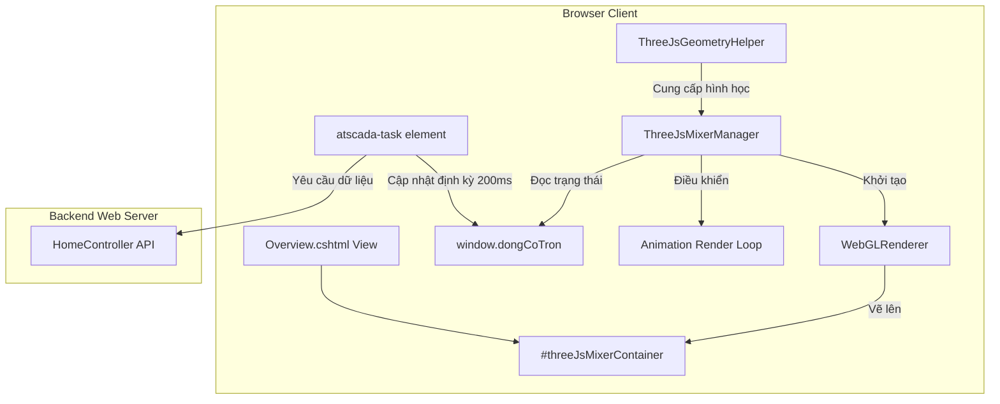
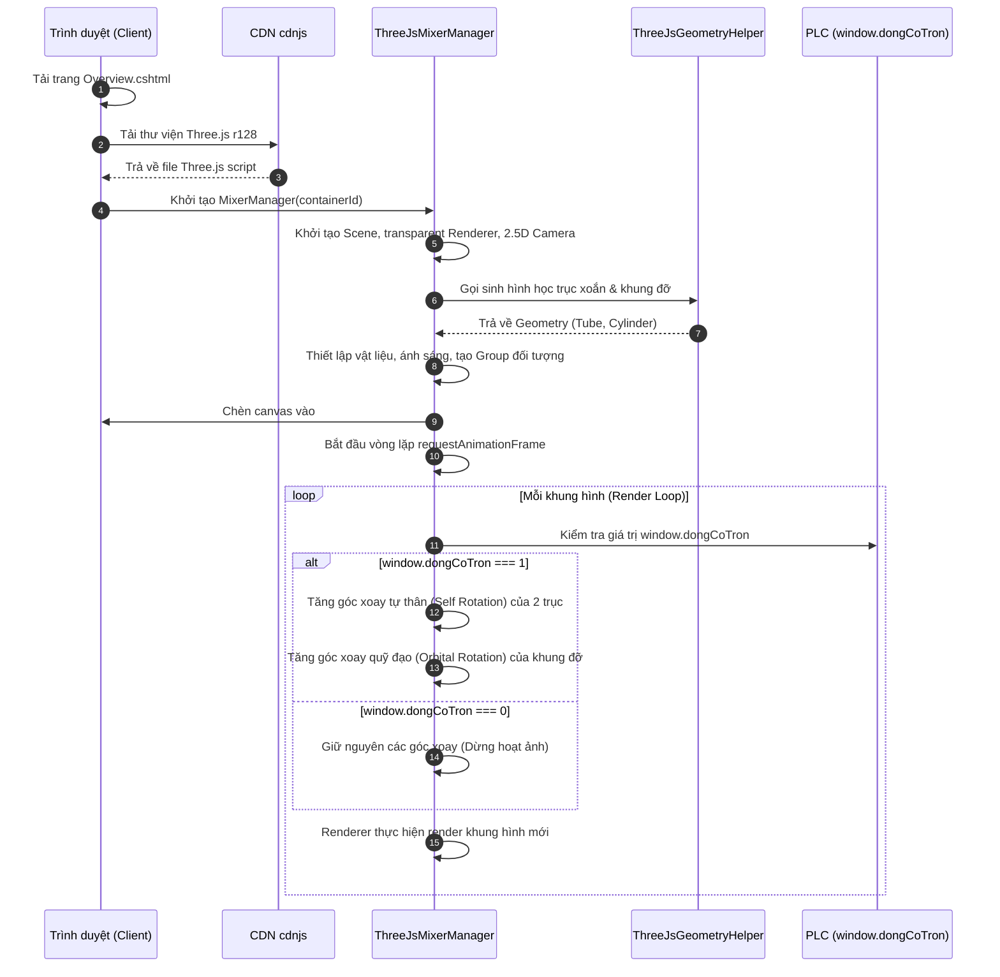

# Tài liệu Thiết kế Kỹ thuật - Hoạt ảnh 3D Máy trộn

---
**Mục đích**: Tài liệu này định nghĩa chi tiết cấu trúc kiến trúc, các lớp giao tiếp, mô hình dữ liệu và sơ đồ luồng cho việc triển khai hoạt ảnh 3D máy trộn xoắn kép (procedural Three.js) trên trang Overview của hệ thống SCADA AFCHEM.
---

## Overview
Tính năng này cải tiến trực quan hóa giao diện bồn trộn trên trang Overview bằng cách phủ một canvas WebGL 3D lên thân bồn trộn 2D hiện tại. Hoạt ảnh 3D sẽ mô phỏng hai trục trộn dạng xoắn kép quay tự thân và xoay quỹ đạo quanh trục bồn chứa.

### Goals
- Tích hợp thành công thư viện Three.js từ CDN mà không gây ảnh hưởng đến thời gian tải trang ban đầu.
- Dựng thành công hình học trục xoắn kép và khung đỡ bằng mã nguồn (procedural generation) thời gian chạy.
- Định vị canvas 3D khớp chính xác và co giãn responsive theo ảnh bồn trộn nền 2D (`sodobontron2.jpeg`).
- Điều khiển hoạt ảnh chạy/dừng mượt mà dựa trên biến SCADA thời gian thực `window.dongCoTron` thu được từ PLC.

### Non-Goals
- Không thay đổi hoặc thay thế các hoạt ảnh SVG của đường cấp liệu (feeding) hoặc đường xả đáy (discharge).
- Không liên kết tốc độ quay động của động cơ 3D với tần số RPM thực tế từ PLC (giữ tốc độ cố định khi hoạt động).
- Không tải tệp mô hình 3D tĩnh (GLTF/GLB) từ máy chủ để tiết kiệm tài nguyên mạng.

---

## Architecture

### Existing Architecture Analysis
Hệ thống hiện tại là ứng dụng ASP.NET MVC 5 hoạt động phía Client sử dụng thư viện jQuery 3.4.1 và Bootstrap 3.4.1. Giao diện Overview hiển thị một ảnh nền tĩnh `sodobontron2.jpeg` bên trong thẻ `.tank-image-wrapper` có cấu trúc CSS `position: relative`. Phía trên ảnh nền là lớp SVG `svg-flow-layer` định vị tuyệt đối (`position: absolute`) hiển thị các hoạt ảnh luồng chuyển động.

Để tích hợp Three.js, ta sẽ chèn một thẻ container `<div id="threeJsMixerContainer">` định vị tuyệt đối nằm đè lên khu vực trộn của bồn chứa, nằm dưới lớp SVG điều hướng luồng nhưng nằm trên bức ảnh nền.

### Architecture Pattern & Boundary Map
Dưới đây là kiến trúc tích hợp các cấu phần phía Client:



### Technology Stack

| Layer | Choice / Version | Role in Feature | Notes |
|-------|------------------|-----------------|-------|
| Frontend / Library | Three.js (r128) | Thư viện đồ họa WebGL chính | Tải từ CDN cdnjs, dung lượng nén ~140KB. |
| View Layout | Razor cshtml | Chứa mã HTML và nhúng script | Tích hợp vào View Overview.cshtml. |
| Real-time State | Javascript Global | Cung cấp tín hiệu chạy động cơ | Sử dụng biến `window.dongCoTron` có sẵn. |

---

## System Flows

### Hoạt động Khởi tạo và Vòng lặp Animation

Sơ đồ tuần tự dưới đây thể hiện luồng tải trang, khởi tạo Three.js và chạy hoạt ảnh dựa trên trạng thái thời gian thực của SCADA:



---

## Requirements Traceability

| Requirement | Summary | Components | Interfaces | Flows |
|-------------|---------|------------|------------|-------|
| 1.1 | Tải Three.js từ CDN | View Overview.cshtml | Script injection | Tải trang |
| 1.2 | Khởi tạo WebGLRenderer | `ThreeJsMixerManager` | `init()` | Khởi tạo |
| 1.3 | Canvas position absolute | CSS stylesheet | CSS rules | Khởi tạo |
| 1.4 | Nền trong suốt & camera 2.5D | `ThreeJsMixerManager` | `init()`, `setupCamera()` | Khởi tạo |
| 1.5 | Window resize handler | `ThreeJsMixerManager` | `resize()` | Responsive |
| 2.1 | Dựng hình 2 trục trộn xoắn kép | `ThreeJsGeometryHelper` | `createHelicalScrew()` | Khởi tạo |
| 2.2 | Dựng hình khung gá đỡ | `ThreeJsGeometryHelper` | `createCarrierBracket()` | Khởi tạo |
| 2.3 | Áp dụng vật liệu & ánh sáng | `ThreeJsMixerManager` | `setupScene()` | Khởi tạo |
| 3.1 | Hoạt ảnh tự xoay của trục | `ThreeJsMixerManager` | `animate()` | Render Loop |
| 3.2 | Hoạt ảnh quỹ đạo của khung đỡ | `ThreeJsMixerManager` | `animate()` | Render Loop |
| 3.3 | Dừng hoạt ảnh khi động cơ tắt | `ThreeJsMixerManager` | `animate()` | Render Loop |

---

## Components and Interfaces

### Giao diện và Cấu phần điều khiển

| Component | Domain/Layer | Intent | Req Coverage | Key Dependencies | Contracts |
|-----------|--------------|--------|--------------|------------------|-----------|
| `ThreeJsMixerManager` | UI / Graphics | Quản lý vòng đời Three.js, camera, renderer và chạy animation | 1.2, 1.4, 1.5, 2.3, 3.1, 3.2, 3.3 | `ThreeJsGeometryHelper` (P0) | IMixerSystem |
| `ThreeJsGeometryHelper` | Graphics Helper | Sinh hình học dạng xoắn và khung gá bằng toán học | 2.1, 2.2 | Thư viện Three.js (P0) | Geometry creation |

#### 1. Cấu phần `ThreeJsMixerManager`
- **Intent**: Quản lý thiết lập Scene, Camera, Renderer, luồng Animation Loop và phản hồi sự kiện Resize.
- **Requirements**: 1.2, 1.4, 1.5, 2.3, 3.1, 3.2, 3.3
- **Dependencies**:
  - Outbound: `ThreeJsGeometryHelper` (P0)
  - External: Thư viện `Three` (P0)

##### Contracts (IMixerSystem)
```typescript
interface IMixerSystem {
  container: HTMLElement;
  renderer: THREE.WebGLRenderer;
  scene: THREE.Scene;
  camera: THREE.OrthographicCamera | THREE.PerspectiveCamera;
  mixerGroup: THREE.Group; // Chứa toàn bộ hệ thống trục quay
  leftShaft: THREE.Group;  // Trục trái
  rightShaft: THREE.Group; // Trục phải
  
  init(): void;
  setupScene(): void;
  setupCamera(): void;
  animate(): void;
  resize(): void;
  dispose(): void;
}
```

##### Chi tiết Phương thức
- **`init()`**: Khởi tạo WebGLRenderer với `alpha: true`, thiết lập khử răng cưa `antialias: true`. Lắng nghe sự kiện `window.addEventListener('resize', ...)`.
- **`setupScene()`**:
  - Tạo mô hình trục trộn và khung gá qua `ThreeJsGeometryHelper`.
  - Thiết lập nguồn sáng: `THREE.AmbientLight` (ánh sáng môi trường dịu) và `THREE.DirectionalLight` (ánh sáng định hướng để tạo bóng kim loại chân thực).
  - Định vị nhóm máy trộn ở tọa độ phù hợp.
- **`setupCamera()`**: Sử dụng góc nhìn cố định hơi chếch từ trên xuống (ví dụ: góc nghiêng 15 độ quanh trục X) để tạo góc nhìn 2.5D tĩnh trùng khớp với hình bồn trộn 2D bên dưới.
- **`animate()`**: Gọi qua `requestAnimationFrame`. Kiểm tra biến `window.dongCoTron`. Nếu bằng 1, xoay trục cục bộ `leftShaft.rotation.y` và `rightShaft.rotation.y` đồng thời xoay `mixerGroup.rotation.y`. Gọi `renderer.render(scene, camera)`.

#### 2. Cấu phần `ThreeJsGeometryHelper`
- **Intent**: Sinh hình học xoắn kép bằng các thuật toán tính toán tọa độ đường xoắn ốc để đưa vào `THREE.TubeGeometry`.
- **Requirements**: 2.1, 2.2
- **Dependencies**:
  - External: Thư viện `Three` (P0)

##### Contracts (Geometry creation)
```typescript
class HelixCurve extends THREE.Curve<THREE.Vector3> {
  radius: number;
  turns: number;
  height: number;
  constructor(radius: number, turns: number, height: number);
  getPoint(t: number, optionalTarget?: THREE.Vector3): THREE.Vector3;
}

interface IGeometryHelper {
  createHelicalScrew(shaftRadius: number, helixRadius: number, turns: number, height: number): THREE.Group;
  createCarrierBracket(distance: number): THREE.Group;
}
```
##### Chi tiết thuật toán HelixCurve
Phương thức `getPoint(t)` tính tọa độ đường xoắn ốc chạy dọc theo chiều cao:
$$\text{angle} = t \cdot \text{turns} \cdot 2 \pi$$
$$x = \text{radius} \cdot \cos(\text{angle})$$
$$y = (t - 0.5) \cdot \text{height}$$
$$z = \text{radius} \cdot \sin(\text{angle})$$
Đường cong này sau đó được truyền vào `new THREE.TubeGeometry(curve, 100, tubeRadius, 8, false)` tạo thành cánh xoắn bao quanh trục xi lanh trung tâm.

---

## Data Models
**Không có thay đổi về mô hình dữ liệu (No Data Model Changes)**.
*Lý do*: Tính năng hoạt ảnh 3D chạy hoàn toàn ở phía client và được điều khiển bởi trạng thái Scada thời gian thực có sẵn trong hệ thống qua biến toàn cục `window.dongCoTron`. Không cần lưu trữ cấu trúc dữ liệu mới hay thay đổi bảng cơ sở dữ liệu MySQL backend.

---

## Error Handling

### Error Strategy
Hệ thống đồ họa 3D phía Client phải đảm bảo không làm gián đoạn trải nghiệm SCADA cơ bản nếu xảy ra lỗi. Do đó áp dụng chiến lược **Graceful Degradation** (Suy giảm chất lượng trải nghiệm có kiểm soát).

### Error Categories and Responses
- **Không hỗ trợ WebGL hoặc trình duyệt cũ:**
  - *Response*: If trình duyệt không hỗ trợ WebGL hoặc WebGL bị tắt, the Web Application shall ẩn container 3D, ghi log cảnh báo ra console và hiển thị hoạt ảnh dòng chảy 2D SVG nguyên bản thay thế để người vận hành vẫn giám sát được thiết bị.
- **Lỗi tải thư viện CDN (Network timeout/offline):**
  - *Response*: If không thể tải Three.js từ CDN sau 10 giây, the Web Application shall bỏ qua bước khởi tạo 3D và kích hoạt chế độ dự phòng hiển thị SVG 2D.
- **Lỗi tính toán kích thước khung chứa (Resize error):**
  - *Response*: If giá trị kích thước vùng chứa trả về bằng 0 hoặc không hợp lệ, then `resize()` shall bỏ qua việc tính tỷ lệ camera để tránh lỗi chia cho 0 (division by zero).

### Monitoring
- Ghi nhận lỗi tải thư viện hoặc lỗi khởi tạo WebGL thông qua `console.error` để kỹ sư bảo trì kiểm tra qua Web Console khi cần thiết.

---

## Testing Strategy

### Unit Tests
1. Kiểm thử lớp toán học `HelixCurve` đảm bảo các điểm tọa độ trả về đúng quy luật xoắn ốc và nằm trong phạm vi chiều cao chỉ định.
2. Kiểm thử phương thức khởi tạo của `ThreeJsGeometryHelper` đảm bảo tạo ra đối tượng thuộc lớp `THREE.Group` chứa các mesh hợp lệ.
3. Kiểm thử hàm kiểm tra trạng thái điều khiển hoạt ảnh phản hồi đúng tương quan giữa giá trị `window.dongCoTron` và cờ trạng thái chạy/dừng.
4. Kiểm thử hàm giải phóng bộ nhớ `dispose()` đảm bảo mọi geometry, material và renderer đã được giải phóng hoàn toàn để tránh rò rỉ WebGL context.
5. Kiểm thử hàm định vị tỉ lệ đảm bảo tính đúng tọa độ tương đối dựa trên phần trăm kích thước bồn chứa.

### Integration Tests
1. Kiểm thử tích hợp sự kiện `resize` của cửa sổ trình duyệt đảm bảo canvas 3D cập nhật kích thước tương thích với khung bao `.tank-image-wrapper`.
2. Kiểm thử tích hợp sự kiện thời gian thực (realtime task update) giả lập thay đổi biến `window.dongCoTron` từ 0 lên 1 và ngược lại, xác nhận animation bắt đầu/kết thúc tương ứng mà không cần tải lại trang.
3. Kiểm thử hiệu suất kết xuất hoạt ảnh WebGL chạy liên tục trên các thiết bị cấu hình trung bình đảm bảo hiệu ứng mượt mà và không gây gián đoạn cho luồng tải dữ liệu SCADA định kỳ 200ms.

---

## Security Considerations
- **Subresource Integrity (SRI)**: Phải sử dụng mã băm bảo mật khi tải Three.js từ CDN để tránh nguy cơ tiêm mã độc (RCE) thông qua mạng phân phối nội dung:
  ```html
  <script src="https://cdnjs.cloudflare.com/ajax/libs/three.js/r128/three.min.js" 
          integrity="sha512-dLk2SgVxRlXdB6W9aB47Uj4qU08qFhN1XoE0j14wQ8U8Fz0V2A9L/zWUXJbT2b9qQd/2B7Xf9v8g=" 
          crossorigin="anonymous" referrerpolicy="no-referrer"></script>
  ```
- **XSS Prevention**: Three.js canvas hoàn toàn là tĩnh/đồ họa và không lấy dữ liệu nhập vào từ người dùng (User input) để hiển thị văn bản, đảm bảo không có lỗ hổng XSS liên quan đến vẽ 3D.

---

## Performance & Scalability
- **Localized Viewport Size**: Canvas chỉ hiển thị đè đúng khu vực trộn (kích thước ước lượng 300x400px tùy kích thước trình duyệt) thay vì render toàn màn hình. Điều này giúp giảm đáng kể số lượng pixel WebGL cần vẽ (Fill-rate), duy trì tải CPU/GPU cực thấp (< 5%).
- **Procedural Geometry Cache**: Sinh hình học duy nhất một lần tại thời điểm tải trang và lưu trữ trong bộ nhớ đệm, luồng loop chỉ tính toán cập nhật các ma trận góc xoay (rotation matrices), giúp duy trì hiệu năng mượt mà ở mức 60 FPS ổn định.
- **Mesh Complexity Optimization**: Số lượng phân đoạn (segments) của đường xoắn được thiết lập vừa phải (ví dụ: 8 segments cho tiết diện ống và 64 segments chạy dọc đường cong), đủ mượt ở khoảng cách nhìn SCADA mà không gây quá tải số lượng đa giác (polygon count).
