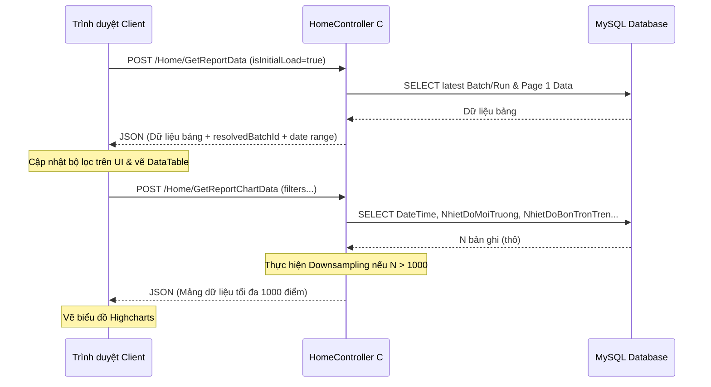

# Tài liệu Thiết kế Kỹ thuật (Technical Design Document) - Biểu đồ Nhiệt độ trang Báo cáo

Tài liệu này xác định thiết kế chi tiết cho việc tích hợp biểu đồ đường nhiệt độ trên trang Báo cáo (Report), bao gồm thiết kế API Backend, thiết kế giao diện Frontend, cấu hình Highcharts và đồng bộ dữ liệu.

---

## 1. Tổng quan (Overview)
- **Mục tiêu**: Bổ sung một biểu đồ đường (Line Chart) động hiển thị 5 đường thông số nhiệt độ lịch sử lấy từ bảng `alarmreport`.
- **Người dùng**: Người vận hành hệ thống muốn đối chiếu trực quan các thông số nhiệt độ của bồn trộn và nhiệt độ môi trường với mức nhiệt tiêu chuẩn (40°C).
- **Vị trí hiển thị**: Phía trên bảng báo cáo DataTable, bọc trong card của AdminLTE hỗ trợ thu gọn/mở rộng.

---

## 2. Kiến trúc & Luồng dữ liệu (Architecture & Data Flow)

### Luồng tương tác (Sequence Flow)
1. **Tải trang**: Trang `Report.cshtml` tải DataTable lần đầu → Server xác định lô hàng (batch) / mẻ con (run) gần nhất và trả về kèm dữ liệu trang 1 của bảng.
2. **Khởi tạo bộ lọc**: Frontend nhận thông tin mẻ mặc định, cập nhật lên Datepicker và Dropdowns, sau đó gọi AJAX `GetReportChartData`.
3. **Truy vấn & Lấy mẫu**: Backend nhận bộ lọc → Truy vấn toàn bộ dữ liệu đo trong mẻ/khoảng thời gian → Thực hiện **Downsampling** trên Backend nếu tổng số điểm `N > 1000` → Trả về mảng JSON.
4. **Vẽ biểu đồ**: Frontend nhận JSON → Vẽ biểu đồ Highcharts với 5 đường.
5. **Cập nhật**: Khi bấm "Tìm kiếm" → DataTable gọi reload → `xhr.dt` kích hoạt tự động gọi lại `GetReportChartData` để đồng bộ biểu đồ.



---

## 3. Thiết kế chi tiết thành phần (Component Details)

### 3.1. Backend API Endpoint
Tạo mới một Action Method ở [HomeController.cs](file:///c:/Users/tanhv/Project/WebApp_LongDuc_22012025Phase2/WebApp_LongDuc_22012025Phase2/LongDucProjectTest/Controllers/HomeController.cs):
- **Signature**:
  ```csharp
  [HttpPost]
  public JsonResult GetReportChartData(string starttime, string endtime, string batchId, string runId, bool? isInitialLoad, string searchValue)
  ```
- **Hành vi**:
  - Giải quyết batch/run mặc định tương tự như hàm `GetReportData` nếu `isInitialLoad == true`.
  - Xây dựng SQL query lọc theo `a.DateTime`, `a.batchId`, `a.runId` và `searchValue`.
  - Câu lệnh truy vấn:
    ```sql
    SELECT a.DateTime, a.NhietDoMoiTruong, a.NhietDoBonTronTren, a.NhietDoBonTronGiua, a.NhietDoBonTronDuoi
    FROM alarmreport a 
    INNER JOIN batches b ON a.batchId = b.id 
    WHERE 1=1 [filters]
    ORDER BY a.DateTime ASC, a.ID ASC
    ```
  - **Thuật toán Server-side Downsampling**:
    ```csharp
    int totalRows = dt.Rows.Count;
    int maxPoints = 1000;
    int step = 1;
    if (totalRows > maxPoints) {
        step = (int)Math.Ceiling((double)totalRows / maxPoints);
    }
    for (int i = 0; i < totalRows; i += step) {
        // Thêm bản ghi vào danh sách kết quả
    }
    ```
  - Giá trị nhiệt độ được đi qua hàm helper `TryGetTemp(object value)` để chuẩn hóa định dạng.

- **Dữ liệu trả về (JSON Response)**:
  ```json
  [
    {
      "Time": "2026-06-24 10:15:30",
      "NhietDoMT": 32.5,
      "NhietNapBon": 41.2,
      "NhietGiuaBon": 40.8,
      "NhietDayBon": 39.5
    },
    ...
  ]
  ```

### 3.2. Frontend UI/Chart Configuration
Tải các thư viện CDN của Highcharts trong `@section Scripts` ở [Report.cshtml](file:///c:/Users/tanhv/Project/WebApp_LongDuc_22012025Phase2/WebApp_LongDuc_22012025Phase2/LongDucProjectTest/Views/Home/Report.cshtml):
- `https://code.highcharts.com/highcharts.js`
- `https://code.highcharts.com/modules/series-label.js`
- `https://code.highcharts.com/modules/exporting.js`
- `https://code.highcharts.com/modules/export-data.js`
- `https://code.highcharts.com/modules/accessibility.js`
- `https://code.highcharts.com/modules/no-data-to-display.js`

#### Cấu trúc HTML Card (AdminLTE 3):
```html
<div class="card card-outline card-primary" id="reportChartCard" style="background: #1e293b; border-color: #3b82f6; margin-bottom: 1.25rem;">
    <div class="card-header" style="border-bottom: 1px solid rgba(255, 255, 255, 0.05); display: flex; justify-content: space-between; align-items: center; padding: 0.75rem 1.25rem;">
        <h3 class="card-title" style="color: #e2e8f0; font-size: 1rem; font-weight: 600; margin: 0; display: inline-flex; align-items: center; gap: 0.5rem;">
            <i class="fas fa-chart-line" style="color: #00e5ff;"></i> Biểu đồ nhiệt độ hoạt động
        </h3>
        <div class="card-tools">
            <button type="button" class="btn btn-tool" data-card-widget="collapse" style="color: #94a3b8; background: transparent; border: none; padding: 0.25rem 0.5rem; outline: none;">
                <i class="fas fa-minus"></i>
            </button>
        </div>
    </div>
    <div class="card-body" style="padding: 1rem;">
        <div id="reportChartContainer" style="width: 100%; height: 350px;"></div>
    </div>
</div>
```

#### Cấu hình Highcharts Options:
- **Type**: `spline`
- **Zoom**: `zoomType: 'x'`
- **Tooltip**:
  ```javascript
  tooltip: {
      shared: true,
      crosshairs: true,
      backgroundColor: 'rgba(15, 23, 42, 0.95)',
      borderColor: '#3b82f6',
      borderWidth: 1,
      style: { color: '#ffffff' },
      valueSuffix: ' °C'
  }
  ```
- **Series & Colors**:
  1. `Tiêu chuẩn nhiệt độ (40°C)`: màu `#ef4444`, kiểu nét đứt `dashStyle: 'ShortDash'`, không marker, data chứa toàn các giá trị `40.0`.
  2. `Nhiệt độ môi trường`: màu `#10b981` (Xanh lá).
  3. `Nhiệt độ nắp bồn`: màu `#3b82f6` (Xanh dương).
  4. `Nhiệt độ giữa bồn`: màu `#8b5cf6` (Tím).
  5. `Nhiệt độ đáy bồn`: màu `#ec4899` (Hồng).

---

## 4. Rủi ro & Giải pháp giảm thiểu (Risks & Mitigations)
- **Hiệu năng trình duyệt**: Lọc lấy mẫu phía máy chủ (downsampling) đảm bảo tối đa 1000 điểm đo cho mỗi đường, hoàn toàn giải quyết rủi ro lag trình duyệt khi truy vấn khoảng thời gian dài.
- **Trục X bị chồng lấn**: Nếu mốc thời gian hiển thị đầy đủ `yyyy-MM-dd HH:mm:ss` trên trục X, các nhãn sẽ bị đè lên nhau. Giải pháp: Sử dụng hàm formatter để chỉ hiển thị phần giờ phút giây `HH:mm:ss` trên trục X, trong khi tooltip vẫn hiển thị đầy đủ mốc thời gian ngày giờ để người dùng đối chiếu.
