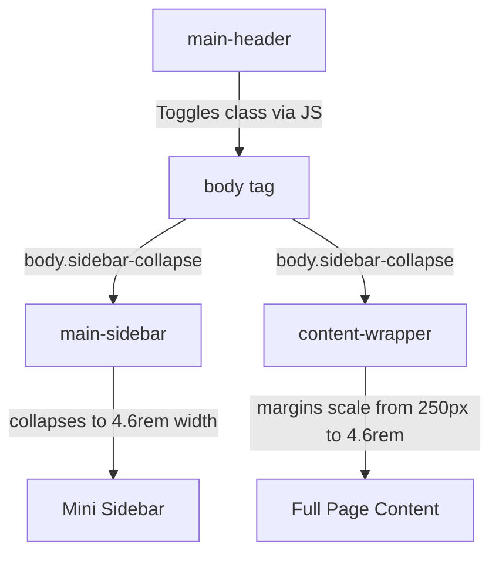
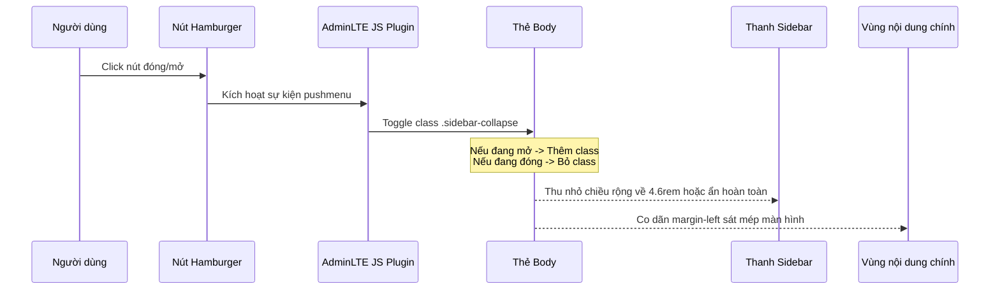

# Tài liệu thiết kế kỹ thuật (Technical Design) - Responsive Pages & Sidebar

## Overview
**Purpose**: Tính năng này giúp tối ưu hóa giao diện hiển thị đáp ứng (responsive) cho thanh điều hướng Sidebar và 5 trang nội dung cốt lõi của hệ thống SCADA AFCHEM. Giúp đảm bảo trải nghiệm người dùng mượt mà, trực quan, không bị tràn viền hay chồng chéo chữ trên các dòng laptop nhỏ, MacBook, máy tính bảng và điện thoại di động.

**Users**: Người vận hành (Operator) và Quản trị viên (Admin) sẽ có thể giám sát hệ thống SCADA ổn định trên các thiết bị di động cá nhân hoặc máy tính xách tay màn hình hẹp khi đi hiện trường hoặc kiểm tra hệ thống từ xa.

**Impact**: Thay đổi các lớp phong cách CSS chung của hệ thống, bổ sung nút điều khiển Pushmenu trong Layout chính và cập nhật phong cách hiển thị biểu đồ/bảng biểu mà không làm thay đổi luồng dữ liệu hay mã nguồn logic C# ở Backend.

### Goals
- Cung cấp tính năng đóng/mở Sidebar bằng nút bấm (Hamburger Button) ở mọi trang.
- Tự động thích ứng bố cục (Layout, Grid) của trang Tổng quan và các bảng báo cáo theo nhiều mốc kích thước màn hình phổ biến.
- Đảm bảo điểm số Cumulative Layout Shift (CLS) thấp và không có hiện tượng vỡ layout trên Safari và Google Chrome trên hệ điều hành macOS.

### Non-Goals
- Không thay đổi thiết kế giao diện màu sắc Premium Dark Theme đã được duyệt.
- Không cấu hình lại cấu trúc dữ liệu gửi qua SignalR/AJAX.
- Không thay đổi phân quyền hiển thị menu của Sidebar (đã có từ trước).

---

## Architecture

### Existing Architecture Analysis
- Khung giao diện sử dụng **Bootstrap 3.4.1** kết hợp với template **AdminLTE**.
- Header có cấu trúc tùy biến nằm đè lên trên Sidebar (`z-index: 1035` so với `1030` của Sidebar).
- Tất cả các trang đều kế thừa `@section Styles` và nhập chung tệp CSS nền tảng `Overview.css`. Điều này cho phép áp dụng các luật CSS responsive chung một cách tập trung mà không cần chỉnh sửa từng file cshtml riêng biệt cho các thuộc tính dùng chung.

### Architecture Pattern & Boundary Map
Sự tương tác giữa Layout chính, Sidebar và các trang con được mô tả bằng sơ đồ ranh giới dưới đây:



### Technology Stack
| Layer | Choice / Version | Role in Feature | Notes |
|-------|------------------|-----------------|-------|
| CSS Layout | Vanilla CSS / CSS Grid & Flexbox | Định hình khung giao diện đáp ứng | Sử dụng `@media` queries kết hợp |
| Front-end Framework | Bootstrap 3.4.1 & AdminLTE 3.x JS | Quản lý hành vi đóng/mở Sidebar tự động | Sử dụng pushmenu plugin tích hợp sẵn |

---

## System Flows

Sơ đồ tuần tự mô tả quá trình xử lý sự kiện Toggle Sidebar:



---

## Requirements Traceability

| Requirement | Summary | Components | CSS / Layout Elements | Flows |
|-------------|---------|------------|-----------------------|-------|
| 1.1 | Hamburger Menu Toggle | Header | `.sidebar-toggle-btn` trong `_LayoutMain.cshtml` | Sequence Toggle |
| 1.2 | Collapsible Sidebar | Layout | Lớp `body.sidebar-collapse` của AdminLTE | Sequence Toggle |
| 1.3 | Sidebar Auto-collapse < 992px | Layout | `@media (max-width: 992px)` trong css | Layout Scale |
| 1.4 | Content Margin Auto-adjust | Wrapper | `.content-wrapper` margin adjustment | Layout Scale |
| 1.5 | Sidebar Scrollability | Sidebar | `.main-sidebar { overflow-y: auto }` | Layout Scale |
| 2.1 | Filter layout > 1200px | Filter | `.filter-inputs { flex-direction: row }` | Layout Scale |
| 2.2 | Filter layout 768px-1200px | Filter | `.filter-inputs { flex-wrap: wrap }` | Layout Scale |
| 2.3 | Filter layout < 768px column | Filter | `.filter-inputs { flex-direction: column }` | Layout Scale |
| 2.4 | Filter actions align < 768px | Filter | `.filter-actions { justify-content: center }` | Layout Scale |
| 3.1 | Horizontal scrollable tables | Table | `.table-responsive` wrapping | Layout Scale |
| 3.2 | Table padding & font scaling < 1200px | Table | `.batch-table th, .batch-table td` | Layout Scale |
| 3.3 | Chart fluid width < 768px | Chart | `.chart-container { width: 100% }` | Layout Scale |
| 4.1 | Vertical timeline < 1200px | Timeline | `.process-timeline-container { flex-direction: column }` | Layout Scale |
| 4.2 | Tank diagram layout < 1500px | Diagram | `.tank-diagram-container { flex-direction: column }` | Layout Scale |
| 4.3 | Tank diagram scale < 768px | Diagram | `.tank-center-wrapper { transform: scale(...) }` | Layout Scale |

---

## Components and Interfaces

Các thành phần giao diện chính cần can thiệp:

### 1. Main Layout & Sidebar
- **Intent**: Quản lý hiển thị của khung điều hướng chính.
- **CSS Rules (Contract)**:
  ```css
  /* Nút bấm toggle menu */
  .sidebar-toggle-btn {
      color: #94a3b8;
      font-size: 20px;
      padding: 0 15px;
      cursor: pointer;
      display: inline-block;
      line-height: 65px;
      transition: color 0.2s;
  }
  .sidebar-toggle-btn:hover {
      color: #ffffff;
  }
  
  /* Căn chỉnh lại ranh giới khi đóng menu */
  body.sidebar-collapse .main-header {
      margin-left: 0 !important;
  }
  body.sidebar-collapse .content-wrapper {
      margin-left: 4.6rem !important;
  }
  @media (max-width: 992px) {
      .main-sidebar {
          transform: translate3d(-250px,0,0);
      }
      body.sidebar-open .main-sidebar {
          transform: translate3d(0,0,0);
      }
      .content-wrapper {
          margin-left: 0 !important;
      }
  }
  ```

### 2. Common Filter Bar & Tables (`Overview.css`)
- **Intent**: Định nghĩa responsive cho các bộ lọc tìm kiếm và bảng dữ liệu.
- **CSS Rules (Contract)**:
  ```css
  /* Responsive bộ lọc */
  @media (max-width: 768px) {
      .filter-inputs {
          flex-direction: column !important;
          align-items: stretch !important;
          gap: 10px !important;
      }
      .filter-group {
          width: 100% !important;
      }
      .filter-group input, .filter-group select {
          width: 100% !important;
      }
      .filter-actions {
          justify-content: center !important;
          flex-direction: column !important;
          gap: 10px !important;
          width: 100% !important;
      }
      .filter-actions .btn-custom {
          width: 100% !important;
          justify-content: center;
      }
  }
  
  /* Tối ưu hóa bảng DataTables */
  @media (max-width: 1200px) {
      .batch-table th, .batch-table td {
          padding: 8px 10px !important;
          font-size: 11px !important;
      }
  }
  ```

---

## Data Models
**No Data Model Changes**: Tính năng này hoàn toàn thuần giao diện (CSS/HTML). Không có thay đổi nào đối với cơ sở dữ liệu MySQL hay luồng trạng thái dữ liệu (state models) của Backend.

---

## Error Handling
- **Layout Shift / Glitches Strategy**: Khi nạp trang, trình duyệt có thể render thanh sidebar chậm hơn hoặc gây hiệu ứng giật khung hình (CLS).
  - *Giải pháp*: Bổ sung thuộc tính `transition: all 0.3s ease-in-out;` cho cả `.content-wrapper` và `.main-sidebar` để các chuyển động thu gọn mượt mà.
  - *Môi trường lỗi*: Nếu trình duyệt không bật Javascript, nút hamburger sẽ không hoạt động. Vì vậy, mặc định trên màn hình rộng sidebar luôn hiển thị bình thường qua CSS gốc.

---

## Testing Strategy

### Unit Tests
Do CSS không có unit test chạy bằng mã lệnh, việc kiểm tra tính chính xác của các CSS rule sẽ được chạy mô phỏng:
1. Đảm bảo lớp `.sidebar-toggle-btn` có thuộc tính `display: inline-block`.
2. Kiểm tra tính đúng đắn của cú pháp `@media` (không thiếu ngoặc nhọn).
3. Đảm bảo toàn bộ các biến CSS được khai báo chuẩn.
4. Đảm bảo không ghi đè đè lớp CSS làm ảnh hưởng đến cấu trúc cột của Bootstrap.
5. Đảm bảo các nút bấm xuất báo cáo bị ẩn đối với Operator ở mọi breakpoint.

### Integration & E2E Tests
Kiểm tra trên các thiết bị và trình duyệt mô phỏng qua DevTools:
1. **Desktop (>1200px)**: Sidebar hiển thị đầy đủ, nội dung dãn ra đúng tỉ lệ, không bị khoảng trống.
2. **MacBook/Laptop (1280px-1440px)**: Header thu gọn font chữ, nội dung bồn xếp lại gọn gàng.
3. **Tablet (768px-1024px)**: Sidebar tự động thu gọn. Bấm nút Hamburger menu trượt Sidebar ra ngoài, click ra ngoài hoặc bấm lại nút Hamburger để ẩn đi.
4. **Mobile (<768px)**: Bộ lọc xếp dọc, bảng hiển thị thanh cuộn ngang độc lập, không tràn viền màn hình điện thoại.

---

## Security Considerations
- **UI Vulnerabilities**: Đảm bảo thuộc tính `data-widget="pushmenu"` không bị tiêm nhiễm mã độc (XSS). Do đây là thuộc tính tĩnh được viết cứng trong file View `.cshtml`, không lấy dữ liệu động từ DB hay tham số URL nên hoàn toàn an toàn trước các cuộc tấn công XSS.

---

## Performance & Scalability
- **Core Web Vitals**:
  - **Cumulative Layout Shift (CLS)**: Target `< 0.1` để tránh nội dung bị dịch chuyển đột ngột khi tải trang.
  - **CSS File Size Impact**: Việc bổ sung các quy tắc CSS responsive sẽ làm tăng dung lượng file CSS thêm không quá `3 KB`, không ảnh hưởng đến băng thông và tốc độ tải trang.
