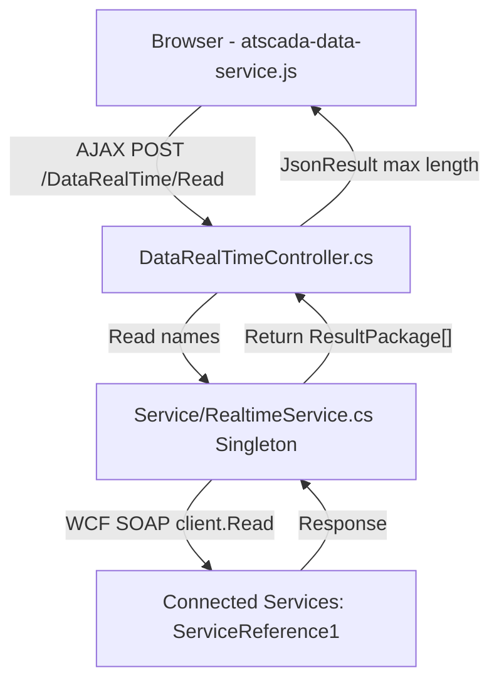

# Báo Cáo Phân Tích Endpoint RealTime & Tổng Hợp Các File Dư Thừa (Refined Unused Files Report)

Tài liệu này cung cấp kết quả phân tích kỹ thuật chi tiết về endpoint real-time `/DataRealTime/Read` và tổng hợp danh sách các file cần giữ lại (Must Preserve), chắc chắn dư thừa (Safe to Delete) và cần xác nhận thêm để tiến hành dọn dẹp hệ thống **AFCHEM SCADA** một cách an toàn và triệt để.

---

## 🔍 Phân Tích Logic Chi Tiết Endpoint `/DataRealTime/Read`

Sau khi kiểm tra toàn bộ luồng truyền nhận dữ liệu, endpoint này đóng vai trò cực kỳ quan trọng trong việc vận hành tính năng hiển thị SCADA real-time trên Web. Dưới đây là kiến trúc luồng dữ liệu của endpoint:

### 1. Phía Client-Side (Trình duyệt)
* **File gọi:** `LongDucProjectTest/JavaScript/Core/Data/atscada-data-service.js`
* **Mô tả:** Định kỳ gửi các AJAX POST request đến `/DataRealTime/Read` (và `/DataRealTime/Write`) để cập nhật thông số vận hành của lò hơi, máy trộn, nhiệt độ, áp suất... từ máy chủ ATSCADA lên giao diện.

### 2. Phía Controller (Backend ASP.NET MVC)
* **File xử lý:** `LongDucProjectTest/Controllers/DataRealTimeController.cs`
* **Action Method:** `public JsonResult Read(string[] names)`
* **Chi tiết logic:**
  - Nhận mảng chuỗi `names` (tên các tag/biến số SCADA cần đọc).
  - Gọi Singleton service: `RealtimeService.Instance.Read(names)`.
  - Trả về dữ liệu định dạng JSON với cấu hình `MaxJsonLength = int.MaxValue` để tránh lỗi tràn bộ nhớ đệm khi gói dữ liệu telemetry quá lớn.

### 3. Phía Service Layer (Lớp dịch vụ kết nối)
* **File xử lý:** `LongDucProjectTest/Service/RealtimeService.cs`
* **Chi tiết logic:**
  - Thiết kế theo mô hình **Singleton (Double-Checked Locking)** để tối ưu tài nguyên kết nối WCF, tránh khởi tạo kết nối trùng lặp.
  - Sử dụng proxy `ATSCADAServiceClient client` để gọi dịch vụ SOAP WCF từ SCADA Server.
  - Tự động phát hiện lỗi mất kết nối (`CommunicationState.Faulted`), gọi hàm `HandleException<T>()` để `Abort()` kết nối lỗi và tái khởi tạo `new ATSCADAServiceClient()` nhằm khôi phục liên lạc tự động.

### 4. Phía WCF Service Reference (Connected Services)
* **Thư mục:** `LongDucProjectTest/Connected Services/ServiceReference1/`
* **Mô tả:** Chứa các file cấu hình và lớp proxy (`Reference.cs`, `ATSCADAService.wsdl`, các file `.xsd`...) được Visual Studio sinh tự động để ánh xạ các phương thức SOAP từ server dịch vụ ATSCADA.
* **Cảnh báo:** Đây là lớp giao tiếp vật lý thiết yếu với phần cứng và dịch vụ nền, tuyệt đối không được xóa hoặc chỉnh sửa nếu không có yêu cầu thay đổi cấu hình kết nối.

---

## 📊 Phân Loại Tài Nguyên Hệ Thống (3 Nhóm)

Để thực hiện dọn dẹp hệ thống không gây ra bất kỳ lỗi runtime hay compile nào, toàn bộ tài nguyên được phân loại thành 3 nhóm rõ ràng dưới đây:

### 🟩 Nhóm 1: Bắt Buộc Giữ Lại (Must Preserve)
Đây là các file mã nguồn, giao diện, dịch vụ cấu thành nên 5 trang chức năng cốt lõi và endpoint Real-time:

1. **Các Giao Diện Razor (Views):**
   - `LongDucProjectTest/Views/Home/Overview.cshtml` (Giao diện SCADA chính)
   - `LongDucProjectTest/Views/Home/Alarm.cshtml` (Trang cảnh báo hệ thống)
   - `LongDucProjectTest/Views/Home/Event.cshtml` (Trang sự kiện)
   - `LongDucProjectTest/Views/Home/Report.cshtml` (Trang xuất báo cáo vận hành)
   - `LongDucProjectTest/Views/Home/UserSetting.cshtml` (Trang quản lý tài khoản/phân quyền)
   - `LongDucProjectTest/Views/Home/Login.cshtml` (Trang đăng nhập hệ thống)
   - `LongDucProjectTest/Views/Shared/_LayoutMain.cshtml` (Layout dùng chung cho 5 trang chính)

2. **Các Controller C# (Controllers):**
   - `LongDucProjectTest/Controllers/HomeController.cs` (Quản lý routing, đăng nhập, phân quyền, xuất báo cáo)
   - `LongDucProjectTest/Controllers/OverviewController.cs` (Xử lý truy vấn dữ liệu trang Overview)
   - `LongDucProjectTest/Controllers/AlarmController.cs` (Truy vấn dữ liệu Alarm)
   - `LongDucProjectTest/Controllers/EventController.cs` (Truy vấn dữ liệu Event/Audit trail)
   - `LongDucProjectTest/Controllers/DataRealTimeController.cs` (CRITICAL: Endpoint `/DataRealTime/Read` và `/DataRealTime/Write`)

3. **Lớp Dịch Vụ & Kết Nối WCF (Services):**
   - `LongDucProjectTest/Service/RealtimeService.cs` (Xử lý trung chuyển dữ liệu Realtime)
   - `LongDucProjectTest/Connected Services/ServiceReference1/` (Toàn bộ thư mục và các file kết nối WCF bên trong)

4. **Các File JavaScript Cốt Lõi (Core Scripts):**
   - `LongDucProjectTest/JavaScript/RealTime/OverviewRealtime.js` (Logic vẽ giao diện máy, cập nhật thông số động trên Overview)
   - `LongDucProjectTest/JavaScript/Core/Data/atscada-data-service.js` (Lớp dịch vụ gọi endpoint đọc/ghi Realtime từ client)
   - Các file JS thư viện trong `Scripts/`, `Content/`, AdminLTE assets, jQuery, Bootstrap.

5. **Tài Nguyên CSS:**
   - `LongDucProjectTest/Css/Overview.css` (Giao diện stylesheet chính của toàn bộ 5 trang)

---

### 🟥 Nhóm 2: Chắc Chắn Dư Thừa (Safe to Delete)
Các tài nguyên thuộc về các dự án phụ, máy phụ hoặc các module đã ngừng hoạt động, có thể xóa hoàn toàn khỏi dự án và ổ đĩa:

1. **Các Dự Án Con (Projects) Trong Thư Mục Gốc:**
   - Thư mục `\Hino.Getdata.Project1\` và file `.csproj` tương ứng.
   - Thư mục `\Hino.Getdata.Project2\` và file `.csproj` tương ứng.

2. **Các Controller Không Sử Dụng:**
   - `LongDucProjectTest/Controllers/BaseController.cs` (Lớp trung gian trống, không dùng)
   - `LongDucProjectTest/Controllers/BaseProject1Controller.cs` (Code máy phụ Project 1 cũ)
   - `LongDucProjectTest/Controllers/DataInverterController.cs` (Code Inverter cũ)
   - `LongDucProjectTest/Controllers/DataProjectController.cs` (Code truy xuất solar cũ)
   - `LongDucProjectTest/Controllers/DataSignageController.cs` (Code Signage quảng cáo cũ)
   - `LongDucProjectTest/Controllers/LDIPController.cs` (Code dự án phụ LDIP)

3. **Các View Razor Không Sử Dụng:**
   - `LongDucProjectTest/Views/Home/Home.cshtml` (Giao diện trang chủ cũ)
   - `LongDucProjectTest/Views/Home/OverviewSignage.cshtml` (Trang Signage cũ)
   - `LongDucProjectTest/Views/Home/Overview.cshtml.bak` (File backup tạm thời)

4. **Các File CSS Không Sử Dụng:**
   - `LongDucProjectTest/Css/Alarm.css`
   - `LongDucProjectTest/Css/chart.css`
   - `LongDucProjectTest/Css/layout.css`
   - `LongDucProjectTest/Css/project.css`

5. **Các File JavaScript Không Sử Dụng:**
   - **Trong `JavaScript/Common/`:** `Count.js`, `WeatherCommon.js`, `EnenrgyPowerCommon.js`, `alarm.js`, `alarmProject.js`, `Home.js`, `LayoutSignage.js`, `changePassword.js`, `Project.js`, `chart.js`, `Sigange.js`, `Signage1.js`, `SignageOverview.js`, `event.js`, `eventProject.js`, `inverter.js`.
   - **Trong `JavaScript/RealTime/`:** `HomeRealtime.js`, `Project1Realtime.js`, `Project2Realtime.js`, `Project3Realtime.js`, `Project4Realtime.js`, `Project5Realtime.js`, `Project6Realtime.js`, `Project7Realtime.js`.
   - **Toàn bộ các thư mục máy phụ trong `JavaScript/RealTime/`:**
     - `JavaScript/RealTime/Project1/`
     - `JavaScript/RealTime/Project2/`
     - `JavaScript/RealTime/Project3/`
     - `JavaScript/RealTime/Project4/`
     - `JavaScript/RealTime/Project5/`
     - `JavaScript/RealTime/Project6/`
     - `JavaScript/RealTime/Project7/`
     - `JavaScript/RealTime/Signage/`

---

### 🟨 Nhóm 3: Cần Xác Nhận Thêm (Needs Confirmation)
Các phần code hoặc thư mục nghi ngờ dư thừa nhưng cần xác nhận từ phía bạn trước khi tiến hành xóa:

1. **Các thư mục gốc liên quan đến Hino cũ:**
   - Thư mục `Hino.Getdata.Common`, `Hino.Parameter.Common`, `Hino.Static.Common`, `Hino.Solar.DatabaseConnection`, `Hino.Solar.DatabaseConnector`, `Hino.Getdata.Project`, `Connect`.
   - *Đánh giá của tôi:* Hiện tại các chức năng kết nối MySQL trong `HomeController.cs`, `OverviewController.cs`, `AlarmController.cs` và `EventController.cs` đều sử dụng lớp `Hino.DatabaseConnector.MySQLConnect`. Do đó, thư mục **`Hino.Solar.DatabaseConnector`** và **`Hino.Getdata.Common`** (chứa lớp helper/role) bắt buộc phải giữ lại. Các thư mục còn lại có thể là dư thừa.
2. **Các Model/Thực thể dữ liệu MySQL đã tắt:**
   - Các bảng `eventlog`, `eventsettings`, `faultcode`, `test` đã ngừng hoạt động trong DB MySQL, tuy nhiên dự án `LongDucProjectTest/Models/` của chúng ta hiện tại đang trống hoàn toàn, nên không có file vật lý nào liên quan cần xóa ở đây.

---

## 🛠️ Kế Hoạch Các Bước Thực Hiện Dọn Dẹp An Toàn

Sau khi được bạn phê duyệt báo cáo này, tôi sẽ tiến hành các bước dọn dẹp sau:

1. **Bước 1: Loại bỏ logic dư thừa trong `HomeController.cs`**
   - Xóa bỏ Action Method `Home()` và `OverviewSignage()`.
2. **Bước 2: Xóa vật lý các file/folder thuộc Nhóm 2**
   - Thực hiện xóa các file Controller, Views, Styles, Scripts đã được phân loại trong Nhóm 2.
3. **Bước 3: Gỡ bỏ tham chiếu trong file cấu hình `.csproj`**
   - Cập nhật file `LongDucProjectTest.csproj` để gỡ bỏ toàn bộ dòng chứa `<Compile Include="..." />` và `<Content Include="..." />` liên quan đến các file bị xóa, tránh việc biên dịch bị lỗi 404 hoặc Compile Error.
4. **Bước 4: Biên dịch và chạy thử hệ thống**
   - Tiến hành build dự án để kiểm tra tính ổn định, đảm bảo các endpoint chính và `/DataRealTime/Read` hoạt động hoàn hảo 100%.

> [!IMPORTANT]
> Toàn bộ các file kết nối WCF trong `Connected Services/ServiceReference1` và file xử lý `DataRealTimeController.cs` sẽ được **bảo vệ nguyên vẹn** và không bị đụng chạm trong suốt quá trình dọn dẹp này.
